# Dasar Pemrograman

## Pemrograman Berorientasi Objek (OOP)

Setelah menamatkan mata kuliah Berpikir Komputasional dan membuat proyek sederhana, biasanya kita merasa: awalnya rapi, lama-lama kode melebar ke mana-mana. Misalnya kita membuat aplikasi monitor drone yang menerima data dari beberapa sumber (GPS, IMU, battery), menampilkannya di UI, lalu mengirim command balik. Jika pendekatannya procedural, pola seperti berikut cepat muncul:

```cpp
// data untuk tiap drone
float drone1_lat, drone1_lon;
float drone2_lat, drone2_lon;

void readDrone1Telemetry() { ... }
void readDrone2Telemetry() { ... }

void drawDrone1OnMap() { ... }
void drawDrone2OnMap() { ... }
```

Saat menambah drone baru, atau menambah satu jenis data baru (mis. `battery`), jumlah variabel dan fungsi naiknya tidak terkendali. Ini yang sering berujung ke *spaghetti code*. Dalam proyek yang lebih besar seperti GCS yang menangani banyak drone, banyak jenis telemetry, dan beberapa tampilan UI, pendekatan ini akan cepat runtuh.

**Object Oriented Programming (OOP)** memecah program menjadi kumpulan *object* yang menyimpan data (state) dan punya perilaku (method). Dengan begitu, kita cukup mendefinisikan *blueprint* (mis. `DroneConnection`), lalu membuat objek sebanyak yang dibutuhkan. Hasilnya lebih terstruktur, mudah dirawat, dan lebih siap untuk skala besar.

### Class dan Object

Secara teknis, **class** adalah *blueprint* yang mendefinisikan atribut (data) dan method (perilaku). **Object** adalah instansinya, yaitu data nyata yang hidup di memori saat program berjalan. Tiap kelas mempunyai atribut yang merepresentasikan karakteristik, keadaan, atau data, serta method yang mendefinisikan perilaku yang bisa dilakukan objek dari kelas tersebut. Secara konkret, atribut adalah variabel yang dimiliki objek, sedangkan method adalah fungsi yang terkait dengan objek tersebut. Secara analogi, class itu seperti skematik/datasheet komponen, sedangkan object adalah komponen fisik yang sudah dirakit.

```cpp
#include <iostream>
using namespace std;

class MotorDC {
public:
    // atribut, menyimpan sifat, karakteristik, keadaan, atau data
    int pin_pwm;
    int pin_dir;
    int speed;

    void maju() {
        cout << "Motor di pin " << pin_pwm
             << " maju dengan speed " << speed << endl;
    }

    void stop() {
        speed = 0;
        cout << "Motor berhenti" << endl;
    }
};

int main() {
    MotorDC motorKiri;
    motorKiri.pin_pwm = 5;
    motorKiri.speed = 100;

    MotorDC motorKanan;
    motorKanan.pin_pwm = 6;
    motorKanan.speed = 100;

    motorKiri.maju();
    motorKanan.maju();
}
```

Di sini, `MotorDC` adalah class yang mendefinisikan atribut `pin_pwm`, `pin_dir`, dan `speed`, serta method `maju()` dan `stop()`. Di `main()`, kita membuat dua objek: `motorKiri` dan `motorKanan`. Masing-masing punya atribut sendiri, tapi method `maju()` dan `stop()` ditulis sekali di class dan bisa dipakai oleh semua objek.

Class diagram (UML) adalah cara ringkas untuk menggambarkan struktur *class*: atribut, method, dan relasi.

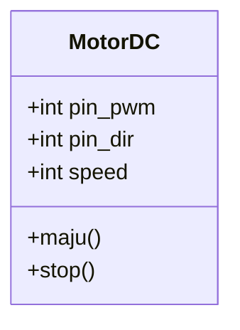

### **Encapsulation**

Encapsulation menjaga integritas data. Artinya, data di dalam objek tidak boleh diakses atau diubah sembarangan dari luar.
Hal ini dicapai dengan membatasi akses ke atribut lewat **access modifier**: `public`, `protected`, dan `private`. Akses untuk membaca dan mengubah data dilakukan lewat *getter*/*setter*, sehingga kita bisa menambah validasi (misalnya menolak nilai GPS yang tidak masuk akal).

| Modifier | Own Class | Derived Class | Main() |
| :---- | :---- | :---- | :---- |
| **Public** | Yes | Yes | Yes |
| **Protected** | Yes | Yes | No |
| **Private** | Yes | No | No |

Access modifier default di C++ adalah `private` untuk class dan `public` untuk struct. Dengan access modifier, kita bisa mengontrol bagaimana data diakses dan dimodifikasi. Misalnya, kita bisa membuat atribut `private` dan bagi siapapun yang mau mengakses nilainya harus lewat method public khusus, yaitu *getter* dan *setter*. *Getter* mengembalikan nilai atribut, sedangkan *setter* mengubah nilainya dengan validasi tertentu supaya perubahan yang dilakukan tidak merusak kondisi objek.

Class diagram juga bisa menunjukkan level akses, misalnya `-` untuk *private* dan `+` untuk *public*:

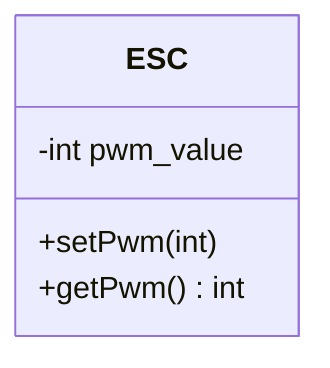

Contoh sederhananya adalah *Electronic Speed Controller* (ESC) biasanya hanya menerima PWM 1000–2000. Jika nilai dibiarkan bebas, hardware bisa rusak. Karena itu, data dibuat `private` dan perubahan dipaksa lewat *setter* yang memvalidasi.

```cpp
#include <iostream>
using namespace std;

class ESC {
private:
    int pwm_value = 1000;

public:
    void setPwm(int nilai) {
        if (nilai > 2000) {
            cout << "Nilai terlalu tinggi, di-cap 2000" << endl;
            pwm_value = 2000;
        } else if (nilai < 1000) {
            pwm_value = 1000;
        } else {
            pwm_value = nilai;
        }
    }

    int getPwm() const {
        return pwm_value;
    }
};
```

Intinya, akses langsung dilarang dan perubahan harus lewat gerbang yang menjaga aturan, yakni *getter/setter*.

### **Abstraction**

Abstraction menyembunyikan detail implementasi dan hanya mengekspos kontrak yang diperlukan. Dengan begitu, pemakai cukup tahu “apa yang bisa dilakukan”, bukan “bagaimana caranya”. Analogi sederhananya, pilot cukup tahu kalau stick dimajuin maka drone maju, tidak perlu paham PID controller, sensor fusion, atau inverse kinematics di balik layar.

Di C++, abstraksi bisa dibuat lewat **abstract class** (boleh punya state dan method default) dan **interface** (murni kontrak). Contoh berikut memakai satu abstract class dan beberapa interface agar terlihat peran masing-masing.

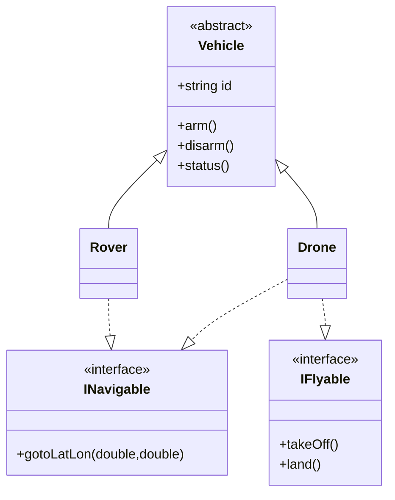

`Vehicle` menjadi kerangka untuk semua kendaraan (punya `id` dan aksi umum `arm()/disarm()`), sedangkan kemampuan spesifik dinyatakan lewat interface. `Drone` mengimplementasikan `INavigable` dan `IFlyable`, sementara `Rover` hanya `INavigable` karena tidak bisa terbang.

`Vehicle` adalah [*abstract class*](https://www.geeksforgeeks.org/cpp/pure-virtual-functions-and-abstract-classes/) karena punya setidaknya satu *pure virtual function* (`status()`), yakni fungsi yang tidak punya implementasi di kelas dasar dan harus di-*override* di turunan. Kelas abstrak tidak bisa diinstansiasi langsung, tetapi menyediakan atribut dan perilaku umum yang bisa dipakai oleh turunannya.

`INavigable` dan `IFlyable` adalah adalah [interface](https://www.geeksforgeeks.org/interfaces-in-cpp/). Interface adalah kontrak yang mendefinisikan sekumpulan method tanpa implementasi. Dalam bahasa yang lebih sederhana, interface itu semacam cetak biru yang hanya menyatakan method apa saja yang harus ada, tanpa menjelaskan bagaimana cara kerjanya. Secara intuitif, interface itu seperti kemampuan atau perilaku tertentu yang bisa dimiliki oleh sebuah kelas.

Di kasus ini, `INavigable` menyatakan kemampuan bernavigasi lewat `gotoLatLon()`, sedangkan `IFlyable` menyatakan kemampuan lepas landas dan mendarat lewat `takeOff()` dan `land()`.

Misalkan kita mau melakukan sesuatu dengan objek apapun yang bisa dinavigasi, kita cukup tahu bahwa objek itu mengimplementasikan `INavigable`, tanpa peduli apakah itu `Drone`, `Rover`, atau lainnya dan bagaimana cara kerjanya di balik layar. Akibatnya, kita bisa langsung gunakan method `gotoLatLon()` tanpa perlu peduli dia sebenarnya objek dari kelas apa, yang penting dia punya kemampuan navigasi (mengimplementasikan interface `INavigable`).

```cpp
#include <iostream>
#include <string>
#include <utility>
using namespace std;

class Vehicle {
protected:
    string id;

public:
    explicit Vehicle(string id_) : id(std::move(id_)) {}
    virtual void arm() {
        cout << "Vehicle " << id << " armed" << endl;
    }
    virtual void disarm() {
        cout << "Vehicle " << id << " disarmed" << endl;
    }
    virtual void status() = 0; // pure virtual function
    virtual ~Vehicle() = default;
};

class INavigable {
public:
    virtual void gotoLatLon(double lat, double lon) = 0;
    virtual ~INavigable() = default;
};

class IFlyable {
public:
    virtual void takeOff() = 0;
    virtual void land() = 0;
    virtual ~IFlyable() = default;
};

class Drone : public Vehicle, public INavigable, public IFlyable {
public:
    explicit Drone(string id_) : Vehicle(std::move(id_)) {}

    void takeOff() override {
        cout << "Drone " << id << " take off" << endl;
    }

    void gotoLatLon(double lat, double lon) override {
        cout << "Drone ke " << lat << ", " << lon << endl;
    }
    void land() override {
        cout << "Drone " << id << " land" << endl;
    }

    void status() override {
        cout << "Drone " << id << " status: AIRBORNE" << endl;
    }
};

class Rover : public Vehicle, public INavigable {
public:
    explicit Rover(string id_) : Vehicle(std::move(id_)) {}

    void gotoLatLon(double lat, double lon) override {
        cout << "Rover ke " << lat << ", " << lon << endl;
    }

    void status() override {
        cout << "Rover " << id << " status: AMANH" << endl;
    }

};

int main() {
    Drone dji("DJI-01");
    dji.arm();
    dji.takeOff();
    dji.gotoLatLon(-6.89, 107.61);

    Rover rover("UGV-01");
    rover.arm();
    rover.gotoLatLon(-6.90, 107.62);
}
```

### **Inheritance**

Inheritance dipakai saat beberapa class memiliki struktur data dan perilaku dasar yang sama. Ini sejalan dengan prinsip *Don't Repeat Yourself (DRY)*, yaitu daripada menyalin kode yang sama berulang‑ulang, kita taruh bagian umum di *base class*, lalu turunan menambah perilaku khusus.

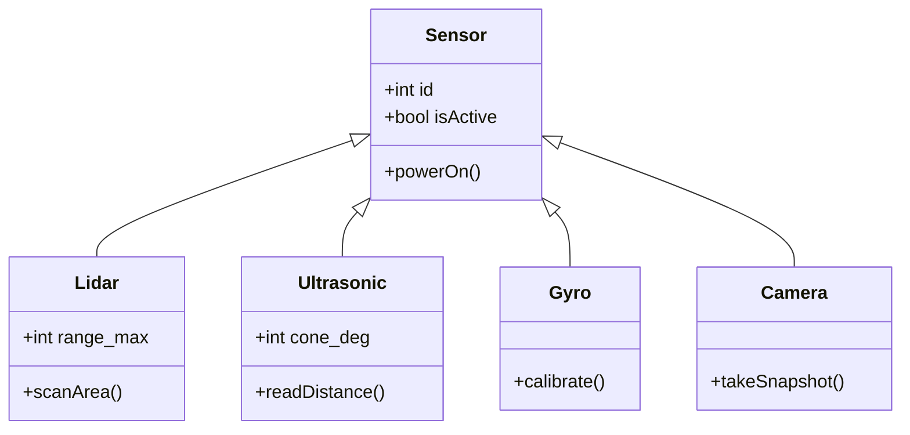

Di sini artinya semua sensor berbagi atribut dasar (`id`, `isActive`) dan method umum (`powerOn()`), lalu masing-masing turunan menambahkan kemampuan spesifik (mis. `scanArea()` pada `Lidar`).

```cpp
#include <iostream>
using namespace std;

class Sensor {
public:
        int id;
        bool isActive = false;

        void powerOn() {
                isActive = true;
                cout << "Sensor nyala." << endl;
        }
};

class Lidar : public Sensor {
public:
        int range_max;
        void scanArea() { cout << "Lidar scanning..." << endl; }
};

class Ultrasonic : public Sensor {
public:
        int cone_deg;
        void readDistance() { cout << "Ultrasonic read distance" << endl; }
};

class Gyro : public Sensor {
public:
        void calibrate() { cout << "Gyro calibrate" << endl; }
};

class Camera : public Sensor {
public:
        void takeSnapshot() { cout << "Camera snapshot" << endl; }
};
```

### **Polymorphism**

Polymorphism secara harfiah berarti "banyak bentuk". Konsep ini memungkinkan kita memanggil method yang sama pada objek berbeda dan tetap mendapatkan perilaku yang sesuai tipe objeknya. Secara teknis, ini berjalan lewat *virtual function* dan *dynamic dispatch*: pemanggilan diputuskan saat runtime berdasarkan tipe objek aktual.

Mungkin sekilas nampak seperti abstraction karena bermain-main dengan interface, tapi kalau Absraction lebih ke menyembunyikan detail, Polymorphism lebih ke fleksibilitas pemanggilan method. Kalau Abstraction menekankan “kontrak apa yang harus ada”, Polymorphism menekankan “bagaimana kontrak itu dipakai seragam untuk banyak objek berbeda” (misalnya diproses dalam satu loop/collection).

Sekilas juga mirip inheritance, tapi fokusnya berbeda. Inheritance adalah tentang berbagi struktur dan perilaku dasar, sedangkan Polymorphism adalah tentang bagaimana method yang sama bisa berperilaku berbeda tergantung objeknya.

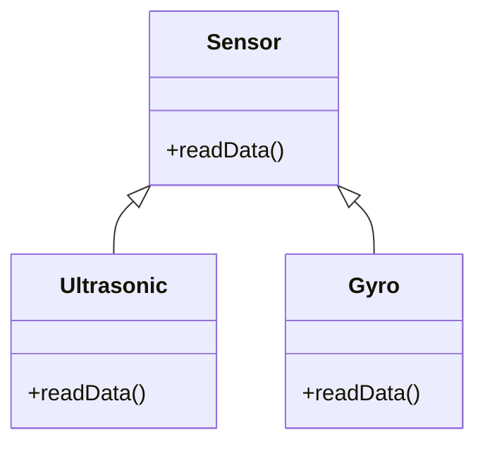

 `Sensor` menyediakan kontrak `readData()`, sementara tiap turunan mengisi implementasi yang spesifik. Saat dipanggil melalui pointer ke `Sensor`, C++ tetap memilih implementasi milik objek sebenarnya.

```cpp
#include <iostream>
#include <vector>
using namespace std;

class Sensor {
public:
    virtual void readData() {
        cout << "Baca data generic..." << endl;
    }
    virtual ~Sensor() = default;
};

class Ultrasonic : public Sensor {
public:
    void readData() override {
        cout << "Ultrasonic: Jarak 50 cm" << endl;
    }
};

class Gyro : public Sensor {
public:
    void readData() override {
        cout << "Gyro: Sudut 90 derajat" << endl;
    }
};

int main() {
    Ultrasonic u;
    Gyro g;
    vector<Sensor*> sensors = {&u, &g};

    for (Sensor* s : sensors) {
        s->readData();
    }
}
```

Di sini, `Sensor` mendefinisikan method virtual `readData()`. `Ultrasonic` dan `Gyro` meng-*override* method ini dengan implementasi spesifik. Di `main()`, kita menyimpan pointer ke berbagai sensor dalam satu vektor dan memanggil `readData()` secara seragam. Berkat *polymorphism*, C++ memilih implementasi yang sesuai untuk tiap objek. Jadi, "banyak bentuk" di sini berarti satu interface (`readData()`) bisa punya banyak implementasi tergantung tipe objeknya.

## Fitur Lanjutan C++

### **Pointer (\*) vs Reference (&)**

Sebelum bicara pointer, kita perlu paham konsep alamat memori. Kita tahu bahwa komputer punya RAM untuk menyimpan data saat program berjalan. Nah, RAM ini seperti lemari arsip dengan banyak laci, dan setiap laci punya nomor unik sebagai alamat.

Ketika program berjalan, setiap variabel/objek disimpan di RAM pada lokasi tertentu di dalam memori, yakni laci dengan nomor unik tersebut. Alamat ini memungkinkan program untuk mengakses data yang disimpan di lokasi tersebut.

**Pointer** adalah variabel yang menyimpan alamat tersebut. Karena yang disimpan adalah alamat, pointer bisa bernilai `nullptr` (*null pointer*, artinya tidak menunjuk ke mana pun) dan diarahkan ulang ke alamat lain. Jika pointer adalah alamat laci, maka untuk mengakses isinya kita perlu membuka laci tersebut. Ini dilakukan dengan operator dereference `*`. Cara akses atribut atau method lewat pointer memakai operator `->`.

**Reference** adalah **nama lain** untuk objek yang sudah ada. Ibaratnya, reference adalah label tambahan yang ditempel di laci arsip. Reference harus diinisialisasi saat deklarasi dan tidak bisa `nullptr`. Setelah diikat ke suatu objek, reference tidak bisa dipindahkan ke objek lain.

Simpelnya, pointer itu seperti alamat rumah, sedangkan reference itu nama lain untuk rumah yang sama. Alamat bisa diganti, nama lain tidak bisa dipindah ke rumah lain.

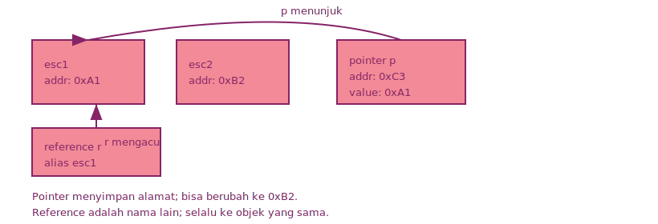

Contoh sederhana berikut menunjukkan cara *dereference* dan perbedaan perilaku pointer vs reference.

```cpp
ESC esc1;
ESC esc2;

ESC* p = &esc1;   // pointer menyimpan alamat esc1
ESC& r = esc1;    // reference adalah alias untuk esc1

// dereference pointer (akses objek yang ditunjuk)
(*p).setPwm(1500);
// akses lewat arrow (lebih praktis)
p->setPwm(1600);
// dua cara di atas sama kayak esc1.setPwm(1600);

// reference diakses seperti objek biasa
r.setPwm(1700); // sama kayak esc1.setPwm(1700);

// pointer bisa diarahkan ulang ke objek lain
p = &esc2; // tadinya p menunjuk ke esc1, sekarang pindah ke esc2
p->setPwm(1800); // esc2.setPwm(1800);

r = esc2; // bukan memindah reference, tetapi menyalin nilai esc2 ke esc1
// sama kayak esc1.setPwm(esc2.getPwm()); atau esc1 = esc2;
```

### Alokasi Dinamis (new/delete)

Kalau kita punya kelas `Sensor`, biasanya kita membuat objeknya di *stack*:

```cpp
Sensor s1; // di stack
s1.read();
```

Namun, cara ini membatasi umur objek sesuai blok kode tempat dia dibuat. Setelah keluar dari blok, objek otomatis dihapus. Untuk objek yang perlu bertahan lebih lama atau ukurannya tidak pasti, kita butuh alokasi di *heap*.

Kadang kita tidak tahu berapa banyak memori yang dibutuhkan saat menulis kode. Misalnya, jumlah sensor yang terhubung bisa berubah-ubah. Untuk itu, C++ menyediakan **alokasi dinamis** dengan `new` dan `delete`. Pada dasarnya, `new` meminta memori dari [*heap*](https://www.geeksforgeeks.org/dsa/heap-data-structure/) (area memori untuk alokasi dinamis) dan mengembalikan pointer ke lokasi tersebut. Setelah selesai, kita harus membebaskan memori dengan `delete` supaya tidak terjadi *memory leak*.

```cpp
#include <iostream>
using namespace std;
class Sensor {
public:
    Sensor() { cout << "Sensor dibuat" << endl; }
    ~Sensor() { cout << "Sensor dihapus" << endl; }
    void read() { cout << "Membaca data sensor" << endl; }
};
int main() {
    // alokasi dinamis
    Sensor* s = new Sensor();
    s->read();

    // bebaskan memori
    delete s;
}
```

### Smart Pointer

Pointer biasa rawan menyebabkan *memory leak* (memori tidak terpakai tapi tidak bisa diakses) dan *dangling pointer* (pointer menunjuk ke memori yang sudah dibebaskan). Untuk mengatasi ini, C++ menyediakan **smart pointer** di pustaka standar (`<memory>`). Smart pointer adalah pembungkus pointer biasa agar memori dilepas otomatis saat sudah tidak dipakai.

Contoh singkat:

```cpp
#include <iostream>
#include <memory>
using namespace std;

class Sensor {
public:
    void read() { cout << "read" << endl; }
};

int main() {
    auto s1 = make_unique<Sensor>(); // unique ownership, cuma bisa ada satu variabel yang pegang pointer ini
    s1->read();

    auto s2 = make_shared<Sensor>(); // shared ownership, bisa ada banyak variabel yang pegang pointer ini. skrg count = 1
    auto s3 = s2;                    // s3 megang shared pointer yang sama, count = 2
    s2->read();
}
```

### **Template Class**

Template memungkinkan class menerima **parameter tipe** di waktu kompilasi. Compiler akan membuat versi class baru untuk setiap tipe yang dipakai. Ini menghindari duplikasi kode tanpa kehilangan performa.

```cpp
#include <iostream>
#include <string>
using namespace std;

template <typename T>
class TelemetryPacket {
public:
    unsigned long timestamp_ms;
    string source;
    T value;
    string unit;

    TelemetryPacket(unsigned long ts, string src, T val, string u)
        : timestamp_ms(ts), source(src), value(val), unit(u) {}

    void print() const {
        cout << "[" << timestamp_ms << "ms] "
             << source << " = " << value << " " << unit << endl;
    }
};

int main() {
    TelemetryPacket<float> alt(1200, "GPS_ALT", 420.69f, "m");
    TelemetryPacket<int> batt(1200, "BATTERY", 67, "%");
    TelemetryPacket<string> mode(1200, "FLIGHT_MODE", "ANGLE", "");

    alt.print();
    batt.print();
    mode.print();
}
```

Keuntungan utamanya: **satu definisi, banyak tipe**, dan perubahan fitur cukup dilakukan di satu tempat.

### **STL Containers**

STL menyediakan *container* siap pakai. Pemilihannya bergantung pada **pola akses data**: akses indeks, insert di tengah, key-value, atau antrian. Untuk detail lengkap, lihat [cppreference container](https://en.cppreference.com/w/cpp/container.html).

**[array](https://en.cppreference.com/w/cpp/container/array.html)**
Cocok saat jumlah elemen sudah pasti sejak awal. Akses indeks sangat cepat, tapi ukurannya tidak bisa berubah.

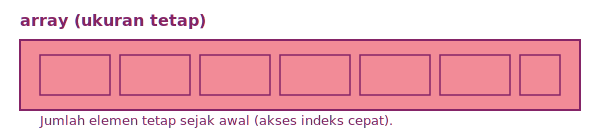

**[vector](https://en.cppreference.com/w/cpp/container/vector.html)**
Pilihan default untuk daftar data. Ukurannya bisa bertambah, akses indeks cepat, dan umumnya punya ruang cadangan (*capacity*) agar penambahan elemen lebih efisien.

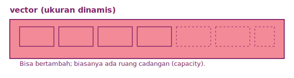

**[list](https://en.cppreference.com/w/cpp/container/list.html)**
Berbasis linked list. Kuat untuk insert/hapus di tengah, tetapi akses indeks lambat karena harus menelusuri node satu per satu.

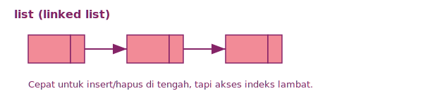

**[set](https://en.cppreference.com/w/cpp/container/set.html)**
Menyimpan elemen unik yang otomatis terurut. Cocok untuk cek keberadaan data tanpa duplikasi.

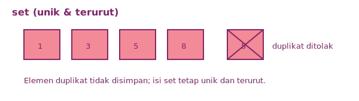

**[map](https://en.cppreference.com/w/cpp/container/map.html)**
Menyimpan pasangan *key-value* yang terurut. Akses data dilakukan melalui *key* sehingga cocok untuk lookup cepat berdasarkan identitas.

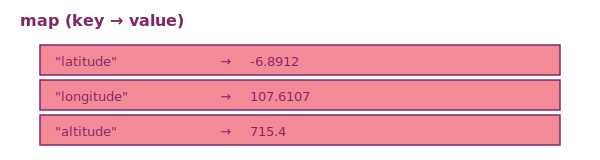

**[stack](https://en.cppreference.com/w/cpp/container/stack.html)**
*Adapter* dengan aturan **LIFO** (*Last In, First Out*). Operasi utamanya **push** (masuk) dan **pop** (keluar dari atas).

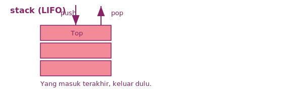

**[queue](https://en.cppreference.com/w/cpp/container/queue.html)**
*Adapter* dengan aturan **FIFO** (*First In, First Out*). Operasi utamanya **enqueue** (masuk dari belakang) dan **dequeue** (keluar dari depan).

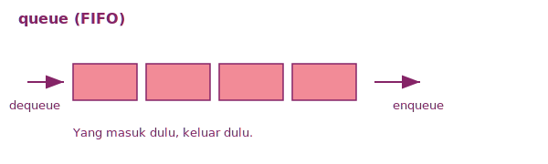

Contoh singkat pemakaian beberapa container:

```cpp
#include <array>
#include <vector>
#include <list>
#include <set>
#include <map>
#include <stack>
#include <queue>

std::array<int, 3> a = {1, 2, 3};
std::vector<int> v = {1, 2}; v.push_back(3);
std::list<int> l = {1, 2, 3};
std::set<int> s = {1, 2, 2, 3}; // duplikat otomatis dihapus
std::map<std::string, int> m; m["alt"] = 120;
std::stack<int> st; st.push(10); st.pop();
std::queue<int> q; q.push(10); q.pop();
```

## **Design Pattern**

Waktu program masih kecil, kita bisa improvisasi dengan bebas. Tapi saat fitur mulai banyak, pola masalah yang sama akan muncul berulang, yaitu kode yang serupa tersebar di banyak tempat, logika makin sulit diikuti, dan perubahan kecil bisa berdampak ke banyak file.

Di titik ini, kita butuh rumus cepat UTBK atau apalah itu untuk merancang program supaya kodenya rapi dan gampang di-*maintain*. Solusinya adalah pola desain atau **design pattern**.

Ada macam-macam masalah dalam pemrograman yang sering muncul berulang, dan *design pattern* adalah pola solusi yang sudah terbukti bekerja bagus dan sering dipakai untuk masalah-masalah umum tersebut. Anggap saja seperti rumus cepat UTBK yang tinggal dipakai sesuai kebutuhan karena tipe soalnya pasti itu-itu aja. Tujuannya lebih ke membuat struktur program lebih rapi, mudah diubah, dan mudah dipahami oleh orang lain.

Kitab suci *design pattern* adalah situs web [refactoring.guru](https://refactoring.guru/design-patterns/cpp), yang mengelompokkan *pattern* ke dalam tiga kategori besar, yaitu *creational*, *structural*, dan *behavioral*. Pola *creational* berhubungan dengan cara membuat objek, *structural* berkaitan dengan cara mengorganisasi kelas dan objek, sedangkan *behavioral* fokus pada interaksi antarobjek.

Untuk *handout* ini, kita akan bahas tiga *pattern* mewakili tiap kategori, yaitu Adapter (*structural*), Observer (*behavioral*), dan Factory (*creational*).

### Adapter

Kadang kita punya dua modul yang “benar” sendiri‑sendiri, tapi antarmukanya tidak cocok. Misalnya sistem baru ingin membaca sensor dengan fungsi `readCelsius()`, sedangkan sensor lama hanya menyediakan `readFahrenheit()`. Mengubah seluruh kode agar paham Fahrenheit bakal bikin berantakan. Ini seperti colokan listrik di beda negara. Perangkatnya bagus, tapi butuh adaptor. Adapter menjadi pihak perantara yang menerjemahkan antara keduanya di tengah. Sistem baru tetap memakai antarmuka yang diinginkan, sementara class lama tetap utuh.

Contoh kasus sederhana:

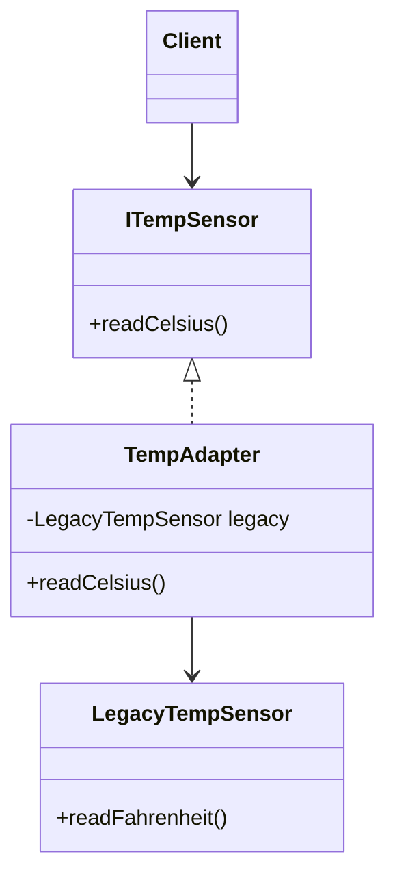

Di sini, `ITempSensor` adalah antarmuka yang diharapkan sistem baru, yakni bisa membaca suhu dalam Celsius (`readCelsius()`). `LegacyTempSensor` adalah class lama yang hanya bisa membaca dalam Fahrenheit. `TempAdapter` mengimplementasikan `ITempSensor` dan di dalamnya memakai `LegacyTempSensor` untuk mendapatkan data, lalu mengonversinya ke Celsius.

. `LegacyTempSensor` adalah class lama yang hanya bisa membaca Fahrenheit. `TempAdapter` mengimplementasikan `ITempSensor` dan menerjemahkan panggilan `readCelsius()` menjadi `readFahrenheit()` dari `LegacyTempSensor`.

Diagram umum pattern:

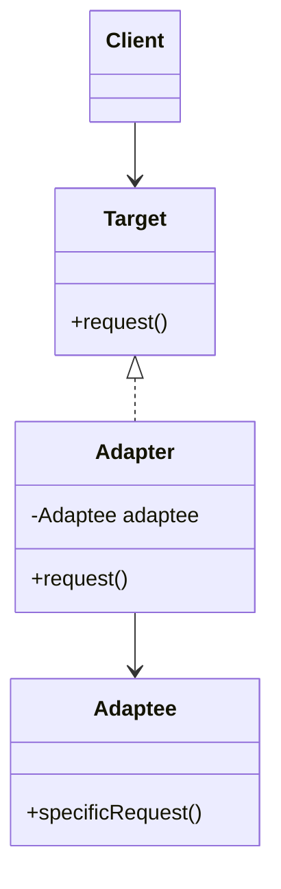

```cpp
#include <iostream>
using namespace std;

class ITempSensor {
public:
        virtual double readCelsius() = 0;
        virtual ~ITempSensor() = default;
};

class LegacyTempSensor {
public:
        double readFahrenheit() { return 86.0; }
};

class TempAdapter : public ITempSensor {
        LegacyTempSensor legacy;
public:
        double readCelsius() override {
                double f = legacy.readFahrenheit();
                return (f - 32.0) * 5.0 / 9.0;
        }
};

int main() {
        TempAdapter adapter;
        cout << adapter.readCelsius() << endl;
}
```

Pada contoh di atas, `TempAdapter` mengimplementasikan `ITempSensor` dan di dalamnya memakai `LegacyTempSensor` untuk mendapatkan data, lalu mengonversinya ke Celsius. Adapter biasanya dipakai saat menggabungkan sistem lama atau library pihak ketiga yang antarmukanya tidak cocok dengan kebutuhan baru.

### Observer

Dalam ROS, data dipublikasikan oleh *publisher* dan diterima banyak *subscriber* pada suatu *topic*. Jika komponen harus saling tahu langsung, maka akan terjadi ketergantungan karena satu perubahan kecil bisa memengaruhi banyak bagian. Ketimbang begitu, bagaimana kalau ada satu pihak yang bertugas menyebarkan informasi ke semua yang berminat? Pola **Observer** menyelesaikan masalah ini dengan memisahkan *publisher* (disebut juga *subject*) dan *subscriber* (disebut juga *observer*). Saat data baru tersedia, *subject* memberi tahu semua *observer* tanpa perlu tahu detail masing-masing.

Kadang pola ini juga disebut **Broker**, karena ada satu perantara yang “mengurus penyebaran” pesan. Dalam bahasa Indonesia, broker artinya *tengkulak* yang menghubungkan produsen dan banyak pembeli.

Contoh kasus sederhana:

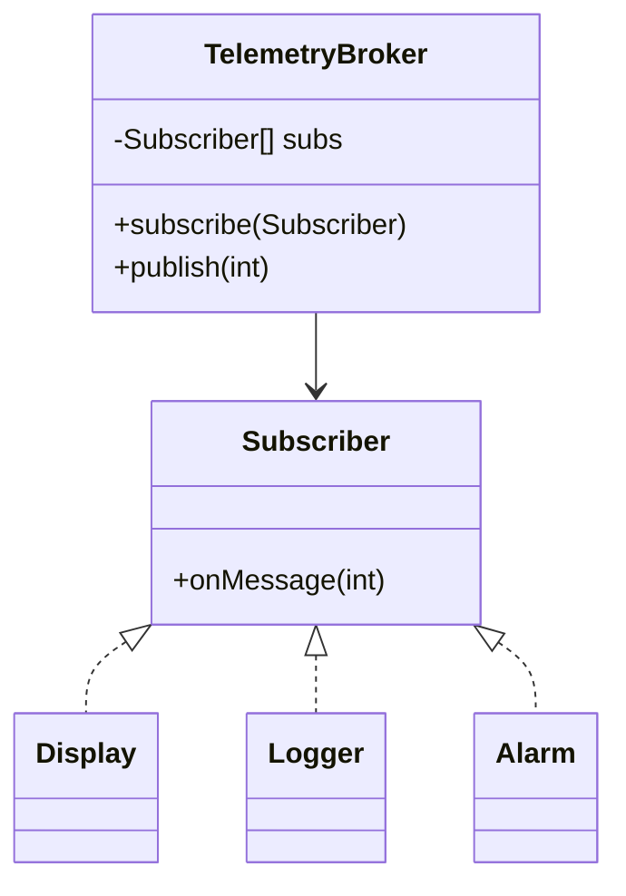

Di sini, `TelemetryBroker` adalah *subject* yang menyimpan daftar `Subscriber`. Saat ada data baru, `publish(int)` dipanggil untuk menyebarkan pesan ke semua subscriber lewat method `onMessage(int)`. `Display`, `Logger`, dan `Alarm` adalah contoh *observer* yang bereaksi terhadap pesan yang diterima.

Diagram umum pattern:

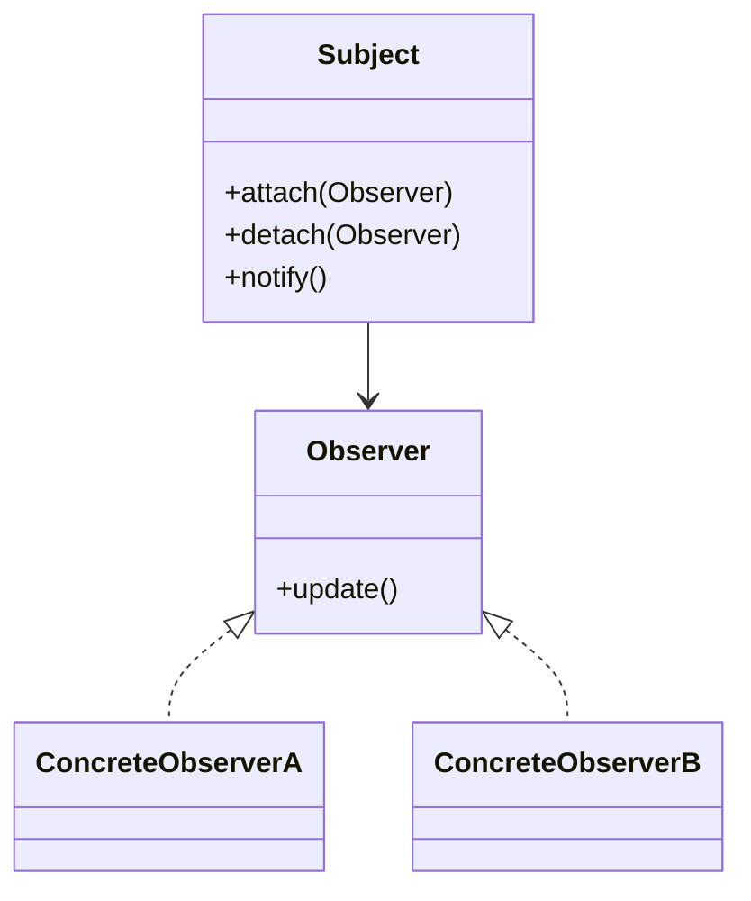

```cpp
#include <iostream>
#include <vector>
using namespace std;

class Subscriber {
public:
        virtual void onMessage(int value) = 0;
        virtual ~Subscriber() = default;
};

class TelemetryBroker {
        vector<Subscriber*> subs;
public:
        void subscribe(Subscriber* s) { subs.push_back(s); }
        void publish(int v) { for (auto* s : subs) s->onMessage(v); }
};

class Display : public Subscriber {
public:
        void onMessage(int value) override { cout << "Display: " << value << endl; }
};

class Logger : public Subscriber {
public:
        void onMessage(int value) override { cout << "Log: " << value << endl; }
};

int main() {
        TelemetryBroker broker;
        Display d;
        Logger l;
        broker.subscribe(&d);
        broker.subscribe(&l);
        broker.publish(42);
}
```

Observer umum dipakai saat **satu perubahan perlu disebarkan ke banyak penerima** (pub/sub, event system, notifikasi).

### Factory

Objek yang kompleks seringkali butuh banyak langkah dan bagian untuk dibuat. Jika kode pembuatan tersebar di banyak tempat, perubahan kecil bisa bikin repot. Pola Factory memusatkan proses pembuatan objek ke satu tempat. Kode lain cukup minta “buatkan objek tipe X” tanpa peduli detailnya.

Contoh kasus sederhana:

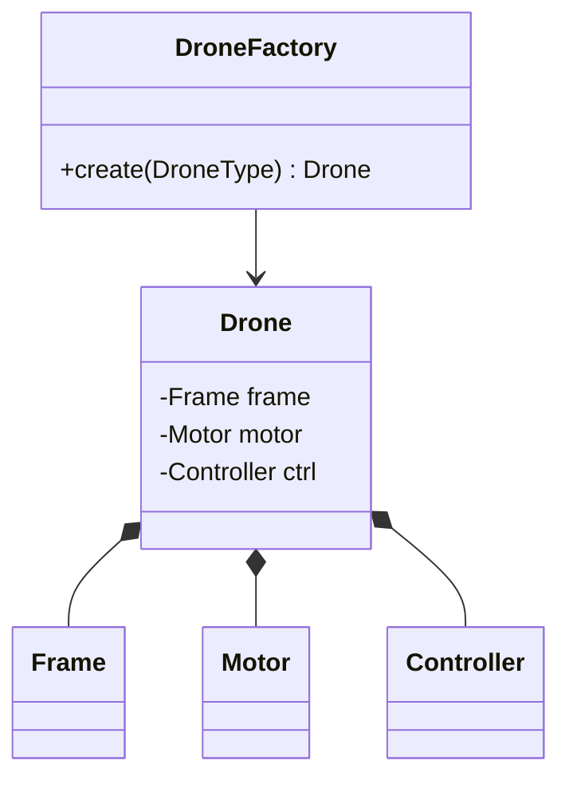

Maknanya: `DroneFactory` bertanggung jawab merakit `Drone` dengan bagian‑bagian yang sesuai. Kode lain hanya meminta “buatkan drone tipe X”.

Diagram umum pattern:

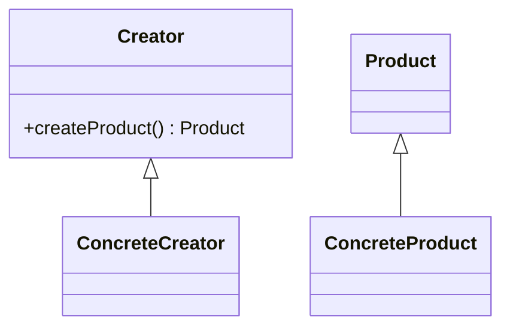

```cpp
#include <iostream>
#include <memory>
using namespace std;

struct Frame { string type; };
struct Motor { string type; };
struct Controller { string type; };

class Drone {
public:
        Frame frame;
        Motor motor;
        Controller controller;

        void info() const {
                cout << frame.type << ", " << motor.type << ", " << controller.type << endl;
        }
};

enum class DroneType { Trainer, Racing };

class DroneFactory {
public:
        static Drone create(DroneType type) {
                Drone d;
                if (type == DroneType::Trainer) {
                        d.frame = {"plastic"};
                        d.motor = {"low-kv"};
                        d.controller = {"stabilized"};
                } else {
                        d.frame = {"carbon"};
                        d.motor = {"high-kv"};
                        d.controller = {"aggressive"};
                }
                return d;
        }
};

int main() {
        Drone trainer = DroneFactory::create(DroneType::Trainer);
        trainer.info();
}
```

Pada contoh ini, `DroneFactory` memiliki method statis `create()` yang merakit `Drone` berdasarkan tipe yang diminta. Kode lain cukup memanggil `DroneFactory::create()` tanpa perlu tahu detail perakitan.

## Pemrograman Konkuren dan Asinkron

Program konkuren menjalankan beberapa tugas secara bergantian atau paralel. Tujuannya bukan selalu “lebih cepat”, tapi membuat alur lebih responsif (misalnya UI tetap berjalan sambil membaca telemetri). Bayangkan proses seperti dapur restoran, sedangkan thread adalah para koki di dapur yang sama. Mereka bisa bekerja paralel, berbagi peralatan, tapi tetap perlu koordinasi.

### Thread Dasar

```cpp
#include <iostream>
#include <thread>
#include <chrono>
using namespace std;

void telemetryLoop() {
    for (int i = 0; i < 3; i++) {
        cout << "telemetry" << endl;
        this_thread::sleep_for(chrono::milliseconds(300));
    }
}

int main() {
    thread t(telemetryLoop);
    for (int i = 0; i < 3; i++) {
        cout << "ui" << endl;
        this_thread::sleep_for(chrono::milliseconds(200));
    }
    t.join();
}
```

### Race Condition dan Mutex

Ketika dua thread mengakses data yang sama, hasilnya bisa kacau. Gunakan **mutex** agar akses ke data bersama hanya satu thread pada satu waktu.

```cpp
#include <mutex>

int altitude = 0;
mutex altitude_mtx;

void updateAlt(int v) {
    lock_guard<mutex> lock(altitude_mtx);
    altitude = v;
}
```

`lock_guard` otomatis membuka kunci saat keluar dari scope.

### Deadlock

Deadlock terjadi ketika dua thread saling menunggu kunci yang dipegang masing‑masing. Contoh sederhana (jangan ditiru):

```cpp
mutex a, b;

void task1() {
    lock_guard<mutex> l1(a);
    lock_guard<mutex> l2(b);
}

void task2() {
    lock_guard<mutex> l1(b);
    lock_guard<mutex> l2(a);
}
```

Solusi umum: **kunci dalam urutan yang sama**, atau gunakan `std::scoped_lock` untuk mengunci beberapa mutex sekaligus.

### Async

`std::async` menjalankan fungsi di thread terpisah dan mengembalikan **future** untuk mengambil hasilnya.

```cpp
#include <future>

int heavyTask() {
    return 42;
}

int main() {
    auto fut = async(launch::async, heavyTask);
    int result = fut.get();
}
```

Dengan async, kita bisa menjalankan pekerjaan berat tanpa memblokir thread utama.

## Referensi Tambahan

## Credits

- Nisrina Zakiyah
- Muhammad Rafi' Abdurrahman
- Zulfaqqar Nayaka Athadiansyah
