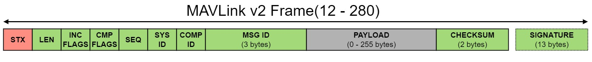
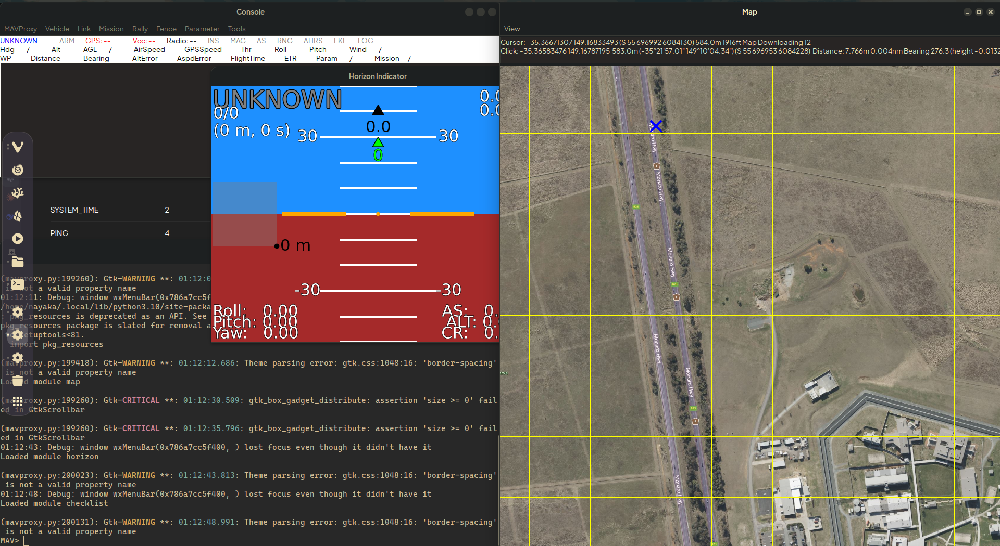

# MAVLink

## Kenapa harus belajar MAVLink?

Di dalam dunia drone dan UAV, komunikasi itu adalah hal yang krusial. Tanpa komunikasi yang baik drone tidak bisa menerima perintah, mengirim data, atau bahkan tahu kondisinya sendiri. Maka dari itu diperlukan protokol komunikasi, yaitu MAVLink.

MAVLink atau Micro Air Vehicle Link adalah protokol komunikasi yang dipakai untuk bertukar informasi/data antara drone, *flight controller*, *ground control station* (GCS), dan perangkat lain. Informasi yang dikirim itu dibungkus dalam bentuk *message* (nanti dibahas). Intinya MAVLink itu bahasa bersama biar setiap komponen drone bisa saling ngobrol dan kerja sama.

MAVLink ini punya beberapa keunggulan: protokolnya ringan dan efisien karena overhead-nya kecil (8 byte per packet di MAVLink 1 dan 14 byte per packet di MAVLink 2), nggak butuh framing tambahan sehingga cocok di bandwidth terbatas.

MAVLink juga sangat *reliable* untuk komunikasi antara berbagai jenis wahana, ground control station, dan node lain pada kondisi yang beragam dan menantang, seperti latensi tinggi dan tingkat *noise* yang besar. MAVLink juga mendukung banyak bahasa pemrograman dan berjalan di berbagai mikrokontroler/*operating system*.

## Struktur

Tiap paket pesan MAVLink tersusun atas format berikut.



- Awal paket (STX) berisi *magic number* 0xFD (dalam heksadesimal) untuk membedakannya dengan protokol lain.  
- LEN adalah panjang *payload* (konten yang dikandung paket), berkisar antara 1 hingga 255.  
- Incompatibility Flags (`INC_FLAGS`) menandai fitur yang wajib didukung *receiver*, kalau tidak maka paket akan ditolak.  
- Compatibility Flags (`COMP_FLAGS`) menandai fitur tambahan yang bersifat opsional. Jika *receiver* tidak mengenali flag ini, paket tetap boleh diproses dan tidak perlu ditolak.  
- Sequence Number (`SEQ`) adalah nomor urut paket yang digunakan untuk mendeteksi kehilangan paket (*packet loss*). Nilainya bertambah dari 0 sampai 255 dan akan kembali ke 0 setelah mencapai batas maksimum.  
- System ID (`SYS_ID`) menunjukkan identitas sistem pengirim pesan, misalnya autopilot atau Ground Control Station, sehingga beberapa sistem dapat berkomunikasi dalam satu jaringan MAVLink.  
- Component ID (`COMP_ID`) menunjukkan identitas komponen di dalam suatu sistem, seperti autopilot utama, kamera, atau *companion computer*.  
- Message ID (`MSG_ID`) adalah identitas jenis pesan yang dikirim. Pada MAVLink 2, Message ID memiliki ukuran 3 byte (24-bit) yang menentukan struktur dan makna *payload*.  
- Payload berisi data utama dari pesan sesuai dengan Message ID. Panjang payload ditentukan oleh nilai LEN dan data disusun dalam format *little-endian*.  
- Checksum terdiri dari 2 byte yang digunakan untuk memverifikasi integritas data. Checksum dihitung dari header (kecuali STX), payload, dan CRC extra untuk memastikan paket tidak rusak selama transmisi.  
- Signature (opsional) digunakan jika fitur message signing diaktifkan. Bagian ini berfungsi untuk meningkatkan keamanan komunikasi dengan mencegah spoofing dan modifikasi paket.

## Mekanisme

### System ID dan Component ID

Sebelum memasuki bagian System ID dan Component ID, perlu diketahui bahwa dalam satu wahana, terdapat berbagai komponen. Beberapa komponen tersebut memiliki kemampuan untuk mengirimkan dan menerima pesan-pesan MAVLink. Oleh karena itu, setiap komponen drone memiliki System ID dan Component ID untuk mengidentifikasi dirinya.

System ID merujuk pada identitas suatu drone. Drone tersebut harus memiliki System ID yang unik dalam satu network MAVLink. Semua komponen yang terdapat pada drone tersebut memiliki System ID yang sama.

Component ID merujuk pada identitas komponen pada drone tersebut.

Contoh:
Ada drone LELA, drone tersebut memiliki komponen A dan B.  
Ada drone VTOL, drone tersebut memiliki komponen D dan F.

Drone LELA komponen A memiliki System ID 1 dan Component ID 1  
Drone LELA komponen B memiliki System ID 1 dan Component ID 2  
Drone VTOL komponen A memiliki System ID 2 dan Component ID 1  
Drone VTOL komponen B memiliki System ID 2 dan Component ID 2

Aturan penggunaan:

- **System ID**
  - System ID harus berada dalam range 1-255.
  - Setiap drone harus memiliki System ID yang unik.
  - Semua komponen yang terdapat pada drone tersebut harus memiliki System ID yang sama.

- **Component ID**
  - Setiap komponen memiliki Component ID yang unik dan umumnya sudah ditentukan. Berikut adalah tabel Component ID yang biasa digunakan:

| Komponen | Component ID |
| ----- | ----- |
| Autopilot (Flight Controller) | 1 |
| Companion Computer | 191-194 |
| Camera | 100-105 |
| Gimbal | 154 |
| GCS | 255 |

### MAVROS

MAVROS adalah jembatan antara ROS dengan MAVLink, yang memungkinkan drone berbasis ROS berkomunikasi dengan flight controller.

Secara singkat, MAVROS bekerja sebagai middleware yang berbicara dengan flight controller menggunakan MAVLink dan berbicara kepada kode ROS dan pengguna menggunakan ROS Topic, Service, dan Action.

Praktik MAVROS:

1. Cara menyambungkan MAVROS dengan FC
   Untuk menyambungkan MAVROS dengan FC, harus dilakukan kedua hal tersebut:

   - Berikan akses pada serial port:

     ```bash
     sudo chmod 666 /dev/ttyACM0
     ```

   - Sambungkan MAVROS:

     ```bash
     ros2 launch mavros apm.launch fcu_url:=serial://<serial>:<baud rate>
     ```

     Contoh:

     ```bash
     ros2 launch mavros apm.launch fcu_url:=serial:///dev/ttyACM0:921600
     ```

   Perhatikan bahwa untuk menyambungkan MAVROS, diperlukan *baud rate*. Nilai *baud rate* berbeda-beda untuk setiap FC. Untuk mencari nilai *baud rate*-nya, harus dites satu per satu dari list berikut:

   - 1200
   - 2400
   - 4800
   - 9600
   - 19200
   - 38400
   - 57600
   - 115200
   - 921600

2. Cara melihat Topic, Service, dan Action yang diberikan MAVROS
   Untuk melihat list Topic, Service, dan Action, dapat digunakan command berikut pada cmd :

   - `ros2 topic list`
   - `ros2 service list`
   - `ros2 action list`

3. Cara menggunakan Topic, Service, dan Action yang diberikan MAVROS
   Untuk menggunakan Topic, Service, dan Action, kita dapat membuat kode node subscriber, publisher, client, dll.

## Messages

MAVLink mempunyai berbagai jenis pesan (*messages*) yang digunakan untuk bertukar informasi antara sistem seperti FC, GCS, dan komponen lainnya. Setiap pesan mempunyai ID unik (Message ID) dan memiliki struktur *payload*-nya sendiri.  
MAVLink mendukung konsep *dialect*, yaitu kumpulan definisi pesan yang dapat disesuaikan dengan kebutuhan sistem tertentu. Hal ini memungkinkan MAVLink digunakan pada berbagai platform dan domain (misalnya UAV, UGV, *marine*, atau *custom system*) tanpa harus membebani semua sistem dengan pesan yang tidak relevan. Dialect umum menyediakan pesan standar, sedangkan dialect khusus memungkinkan penambahan pesan spesifik untuk kebutuhan tertentu.

Berikut adalah beberapa Message ID yang umum digunakan dalam MAVLink ([*common dialect*](https://mavlink.io/en/messages/common.html)):

| Message Name | Message ID | Fungsi |
| ----- | :---: | ----- |
| HEARTBEAT | 0 | Menandakan bahwa sistem masih aktif dan mengirimkan status dasar sistem |
| SYS_STATUS | 1 | Menyediakan informasi status sistem seperti kesehatan sensor dan daya |
| SYSTEM_TIME | 2 | Menyinkronkan waktu sistem |
| PING | 4 | Menguji konektivitas dan latensi komunikasi |
| GPS_RAW_INT | 24 | Data mentah GPS |
| ATTITUDE | 30 | Mengirimkan orientasi wahana (roll, pitch, yaw) |
| LOCAL_POSITION_NED | 32 | Posisi dan kecepatan dalam koordinat lokal NED |
| GLOBAL_POSITION_INT | 33 | Posisi global (lintang, bujur, ketinggian) dalam format integer |
| BATTERY_STATUS | 147 | Informasi status baterai |
| STATUSTEXT | 253 | Pesan teks status atau peringatan dari sistem |

## Implementasi

### MAVProxy


MAVProxy adalah tool command-line yang berfungsi sebagai router, relay, dan controller untuk komunikasi MAVLink antara flight controller dan berbagai aplikasi lain. Secara sederhana, MAVProxy bagaikan GCS versi CLI.

MAVProxy memiliki fungsi yang mirip dengan GCS pada umumnya. MAVProxy dapat melakukan *arm*, *disarm*, ganti *flight mode*, *upload* dan eksekusi *mission*, dan lain-lain. Akan tetapi, MAVProxy tidak dapat melakukan fungsi-fungsi GCS yang berhubungan dengan GUI, seperti menampilkan peta interaktif.

Jika dilihat sekilas, mungkin MAVProxy terlihat lebih inferior dibandingkan GCS pada umumnya. Akan tetapi, MAVProxy memiliki keuntungan sebagai berikut:

- Bisa berjalan di Linux, terutama di headless Linux  
- Lebih ringan
- Stabil untuk long running

Salah satu contoh konkret penggunaan MAVProxy dapat dilihat dari tim LELA. MAVProxy dapat digunakan sebagai MAVLink forwarder untuk telemetri berbasis jaringan seluler (4G). MAVProxy menerima data MAVLink dari flight controller melalui koneksi lokal, seperti USB/serial, lalu meneruskannya melalui jaringan IP ke Ground Control Station yang berada di lokasi yang jauh. Hal ini sangat berguna untuk tim LELA karena pada LELA, wahana bisa berjarak hingga 5 km dari posisi Ground Control Station.

### MAVSDK

MAVSDK adalah Software Development Kit (SDK) yang digunakan untuk membangun aplikasi yang berkomunikasi dengan sistem MAVLink menggunakan bahasa pemrograman tingkat tinggi. Berbeda dengan MAVProxy yang berbentuk tool command-line, MAVSDK ditujukan untuk pengembangan aplikasi seperti Ground Control Station.

MAVSDK menyediakan abstraksi tingkat tinggi terhadap protokol MAVLink, sehingga pengembang tidak perlu berinteraksi langsung dengan struktur paket, Message ID, atau parsing byte. Sebagai contoh, perintah seperti arm, takeoff, atau set flight mode dapat dilakukan melalui pemanggilan fungsi API, bukan dengan mengirim pesan MAVLink secara manual.

MAVSDK mendukung berbagai bahasa pemrograman, seperti C++, Python, Java, dan Swift, sehingga dapat digunakan pada berbagai platform dan sistem operasi. Hal ini membuat MAVSDK cocok untuk pengembangan aplikasi lintas platform, termasuk desktop, embedded system, dan mobile.

Secara fungsional, MAVSDK dapat digunakan untuk mengontrol wahana (arm, disarm, takeoff, landing, dan mode penerbangan), menerima dan memproses data telemetri, mengelola mission (upload, download, dan eksekusi), serta membangun logika otonomi pada companion computer.

Berikut adalah contoh kode menggunakan MAVSDK Python untuk menghubungkan perangkat ke FC, mengubah status *drone* menjadi *arming*, dan membaca data telemetri.

```python
import asyncio

from mavsdk import System


async def run():
   # bikin objek System (buat drone)
   drone = System()

   # Koneksi ke flight controller
   await drone.connect(system_address="udp://:14540")

   async for state in drone.core.connection_state():
      if state.is_connected:
         print("Drone terhubung")
         break

   # Arm drone
   await drone.action.arm()

   # Membaca telemetri
   async for battery in drone.telemetry.battery():
      print(f"Battery: {battery.remaining_percent * 100:.1f}%")
      break


asyncio.run(run())
```

## Referensi

[https://mavsdk.mavlink.io/main/en/index.html](https://mavsdk.mavlink.io/main/en/index.html)  
[https://mavlink.io/en/](https://mavlink.io/en/) (pengen cari lebih dalam di sini)  
[https://www.youtube.com/watch?v=iZ-usX1VXRI&t=157s](https://www.youtube.com/watch?v=iZ-usX1VXRI&t=157s) (tentang MAVLink juga)
