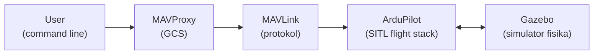
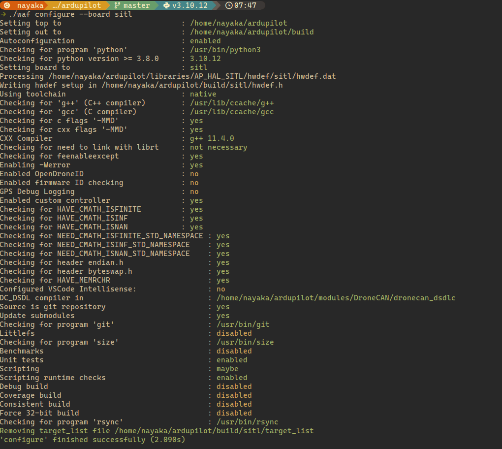
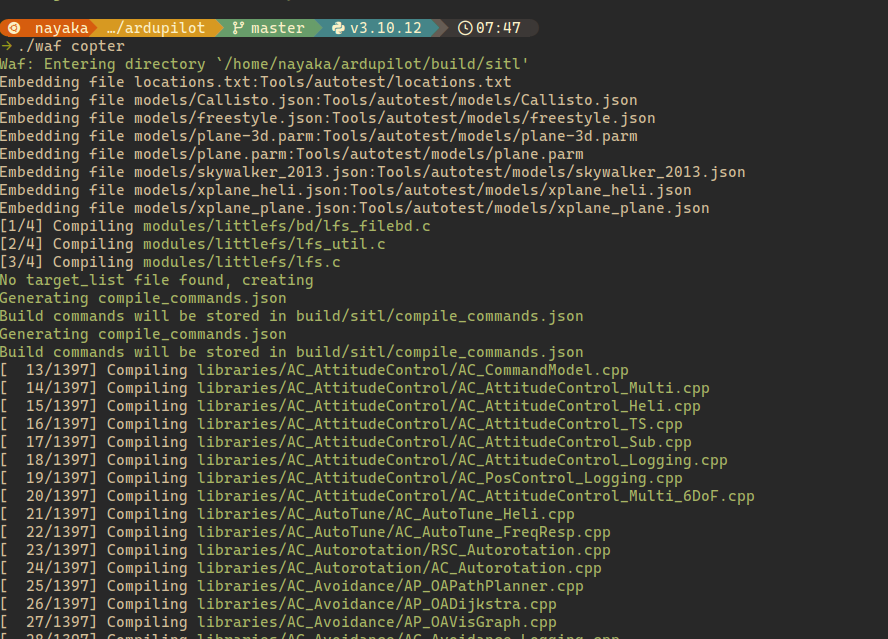
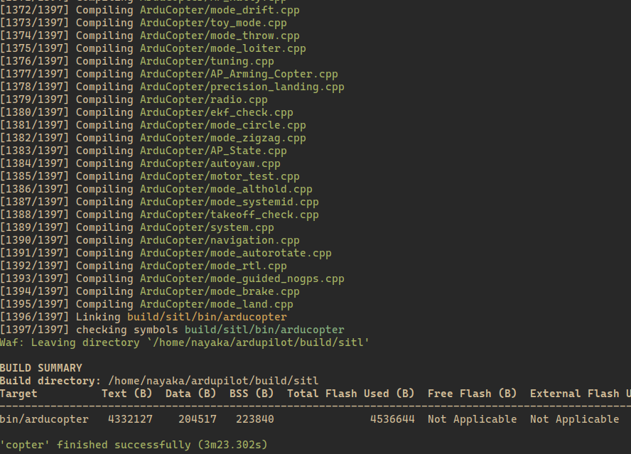
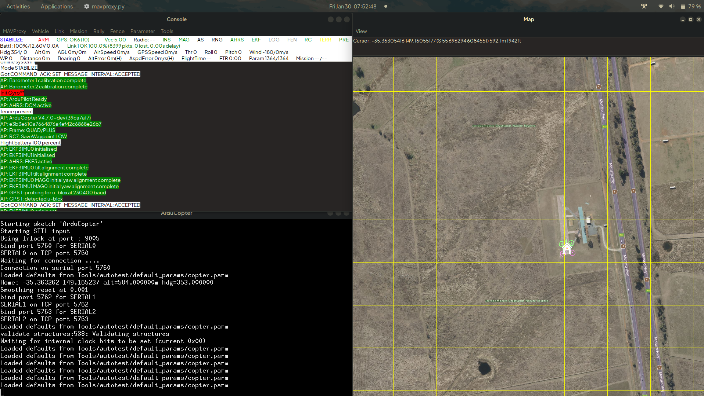
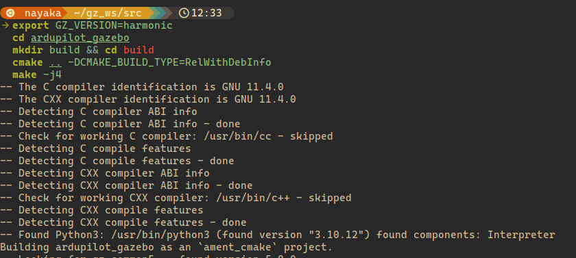
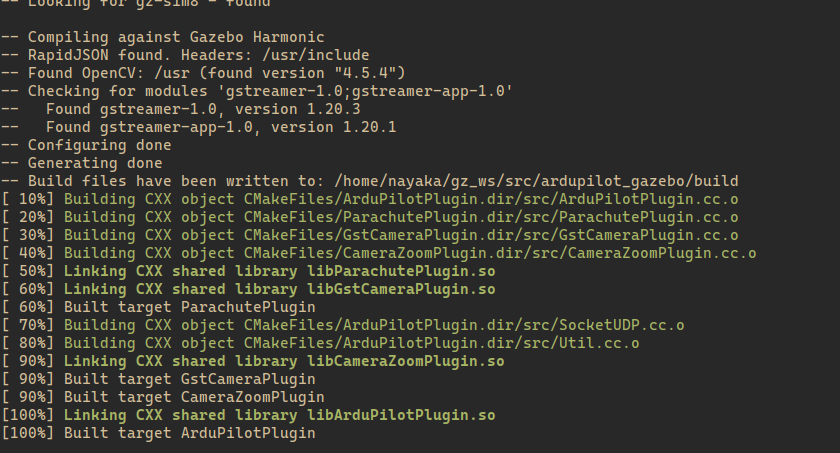
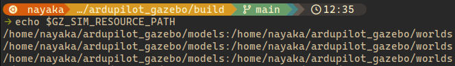

# SITL

## Pendahuluan

Pada materi ini, kita akan berkenalan dengan **SITL** (Software In The Loop) menggunakan [ArduPilot](https://ardupilot.org) sebagai *flight stack* utama karena merupakan *flight stack* yang secara *de facto* dipakai di Aksantara ITB. SITL memungkinkan kita menjalankan dan menguji sistem autopilot drone tanpa menggunakan *hardware* fisik, sehingga sangat cocok untuk proses belajar, eksperimen, dan pengujian awal.
ArduPilot berperan sebagai otak *drone*, yang menjalankan logika penerbangan seperti stabilisasi, navigasi, dan *flight mode*. Dalam mode SITL, ArduPilot dijalankan sebagai program biasa di komputer dan mensimulasikan perilaku *drone* seolah-olah berada di dunia nyata.
Untuk berinteraksi dengan ArduPilot, MAVLink digunakan sebagai protokol komunikasi. Pada praktiknya, interaksi ini difasilitasi oleh MAVProxy, yaitu GCS berbasis command-line yang secara otomatis dijalankan saat SITL berjalan. Melalui MAVProxy, kita dapat mengirim perintah seperti `arm`, `takeoff`, mengganti *flight mode*, serta memantau status *drone*.
Pada tahap awal, SITL dapat dijalankan tanpa simulator fisika. Namun, untuk simulasi yang lebih realistis, kita akan mengintegrasikan ArduPilot dengan Gazebo Harmonic, yang menyediakan simulasi lingkungan, sensor, dan dinamika wahana.

## Pengenalan SITL dan Arsitektur Sistem

Secara umum, SITL dapat dijalankan dalam dua bentuk. SITL tanpa simulator fisika hanya menjalankan ArduPilot dan menerima perintah melalui MAVLink, sehingga cocok untuk memahami flight mode, parameter, dan alur kontrol dasar. Sementara itu, SITL yang terintegrasi dengan Gazebo menambahkan simulasi fisika dan lingkungan, seperti dinamika wahana, sensor (IMU, GPS), serta kondisi dunia nyata. Pendekatan kedua ini memberikan simulasi yang lebih realistis dan mendekati perilaku drone di lapangan.

Dalam arsitektur sistem SITL, ArduPilot berperan sebagai flight stack yang menjalankan seluruh logika penerbangan. Komunikasi antara ArduPilot dan pengguna dilakukan melalui protokol MAVLink, yang difasilitasi oleh MAVProxy sebagai Ground Control Station berbasis command-line. Ketika Gazebo digunakan, Gazebo bertindak sebagai simulator fisika yang menyediakan lingkungan dan sensor, lalu bertukar data dengan ArduPilot melalui plugin Gazebo–ArduPilot.

Berikut diagram alur kerja sistem SITL menggunakan ArduPilot dan Gazebo:



## Flight Stack ArduPilot

### Instalasi

Pertama, kita harus *clone* repositori resmi ArduPilot.

```bash
cd ~
git clone --recurse-submodules https://github.com/ArduPilot/ardupilot.git cd ardupilot
```

Untuk install prasyarat dari ArduPilot:

```bash
Tools/environment_install/install-prereqs-ubuntu.sh -y
```

lalu *reload* PATH.

```bash
. ~/.profile
```

> [!NOTE]
> buat setupnya emang agak lama, **pastikan internet aman** aja ya guys :/<

Habis ini kita harus build dulu. Sebenernya di ArduPilot banyak banget *vehicle* yg bisa dipake tapi seringnya kita make ArduCopter, yakni wahana quadcopter.

```bash
./waf configure --board sitl
```



```bash
./waf copter
```




Parameter `--board` itu bisa diganti apa aja, tapi untuk keperluan SITL kita pakai board `sitl`. Buat cek board apa saja yang tersedia bisa pakai command berikut:

```bash
./waf list_boards
```

More information: [https://ardupilot.org/dev/docs/building-setup-linux.html\#building-setup-linux](https://ardupilot.org/dev/docs/building-setup-linux.html#building-setup-linux)  
[https://github.com/ArduPilot/ardupilot](https://github.com/ArduPilot/ardupilot)  
[https://github.com/ArduPilot/ardupilot/blob/master/BUILD.md](https://github.com/ArduPilot/ardupilot/blob/master/BUILD.md)

### Menjalankan ArduPilot SITL

Jadi ArduPilot yg tadi buat apa sih? itu kek kita buat drone-dronean yang palsu (dalam software) tapi seakan akan ada di dunia nyata. Nah ArduPilot itu membuat kita jadi bisa punya drone tanpa punya drone. Gimana cara jalaninnya?

Ada dua cara, yakni langsung ke folder yang sudah di-*build*,

```bash
cd ardupilot/ArduCopter sim_vehicle.py --console --map -w
```

Atau, kalau di *root,*

```bash
sim_vehicle.py -v copter --console --map -w
```

Habis kaya gitu bakal udah ada Copter sama petanya, kurang lebih kaya gini:


### Kontrol Drone via MAVProxy

NAHH, kerennya adalah kita bisa kasih command ke drone-nya via MAVProxy. Misal kita mau drone-nya takeoff, kita bisa ketik aja di CLI-nya:

```bash
mode guided 
arm throttle 
takeoff 40
```

Habis *takeoff* *drone*\-nya bisa puter-puter:

```bash
mode circle param set circle_radius 2000
```

Selamat anda lulus sarjana SITL\!  
FYI, banyak banget command yang bisa kita pakai disini buat ngendaliin dronenya dalam mode guided. Buat commandnya bisa dilihat di sini:  [https://ardupilot.org/dev/docs/copter-commands-in-guided-mode.html\#copter-commands-in-guided-mode](https://ardupilot.org/dev/docs/copter-commands-in-guided-mode.html#copter-commands-in-guided-mode)

## Gazebo Harmonic

### Instalasi

Pertama-tama, kita tambahkan repositorinya dulu:

```bash
sudo apt-get update
sudo apt-get install curl lsb-release gnupg
sudo curl https://packages.osrfoundation.org/gazebo.gpg --output /usr/share/keyrings/pkgs-osrf-archive-keyring.gpg
echo "deb [arch=$(dpkg --print-architecture) signed-by=/usr/share/keyrings/pkgs-osrf-archive-keyring.gpg] https://packages.osrfoundation.org/gazebo/ubuntu-stable $(lsb_release -cs) main" | sudo tee /etc/apt/sources.list.d/gazebo-stable.list > /dev/null

```

lalu kita instal Gazebo-nya.

```bash
sudo apt-get update
sudo apt-get install gz-harmonic
```

Untuk memeriksa apakah instalasi sudah berhasil, harusnya *command* ini akan menampilkan versi yang sesuai:

```bash
gz sim --versions
```


Kalau sempat muncul output semacam ini saat instalasi tadi:

```bash
E: Could not get lock /var/lib/dpkg/lock-frontend. It is held by process 17521 (unattended-upgr)
```

artinya Ubuntu sedang tengah meng-update package lain di belakang layar sehingga kita perlu tunggu 5-10 menit lalu jalankan instalasi lagi.

### Integrasi ArduPilot-Gazebo
Prasyarat:
```bash
sudo apt update
sudo apt install -y libunwind-dev
sudo apt install libgz-sim8-dev rapidjson-dev
sudo apt install libopencv-dev libgstreamer1.0-dev libgstreamer-plugins-base1.0-dev gstreamer1.0-plugins-bad gstreamer1.0-libav gstreamer1.0-gl
```


Clone repositorinya:

```bash
cd ~
mkdir -p gz_ws/src && cd gz_ws/src
git clone https://github.com/ArduPilot/ardupilot_gazebo
```

lalu build:

```bash
export GZ_VERSION=harmonic
cd ardupilot_gazebo
mkdir build && cd build
cmake .. -DCMAKE_BUILD_TYPE=RelWithDebInfo
make -j4
```



Konfigurasikan environment:

```bash
export GZ_SIM_SYSTEM_PLUGIN_PATH=$HOME/gz_ws/src/ardupilot_gazebo/build:$GZ_SIM_SYSTEM_PLUGIN_PATH
export GZ_SIM_RESOURCE_PATH=$HOME/gz_ws/src/ardupilot_gazebo/models:$HOME/gz_ws/src/ardupilot_gazebo/worlds:$GZ_SIM_RESOURCE_PATH
source ~/.bashrc
```

Untuk memeriksa apakah konfigurasinya sudah benar, coba jalankan

```bash
echo $GZ_SIM_RESOURCE_PATH
```

Harusnya akan ada seperti ini:



### SITL dengan Gazebo

Untuk menguji, coba jalankan ini di satu terminal:

```bash
cd ~/gz_ws/src/ardupilot_gazebo/worlds
gz sim -v4 -r iris_runway.sdf
```

lalu jalankan ini di terminal lain:

```bash
sim_vehicle.py -v ArduCopter -f gazebo-iris --model JSON --map --console
```

## Referensi

[https://ardupilot.org/dev/docs/building-setup-linux.html\#building-setup-linux](https://ardupilot.org/dev/docs/building-setup-linux.html#building-setup-linux)  

[https://github.com/ArduPilot/ardupilot](https://github.com/ArduPilot/ardupilot)  

[https://github.com/ArduPilot/ardupilot/blob/master/BUILD.md](https://github.com/ArduPilot/ardupilot/blob/master/BUILD.md)

[https://ardupilot.org/dev/docs/copter-commands-in-guided-mode.html\#copter-commands-in-guided-mode](https://ardupilot.org/dev/docs/copter-commands-in-guided-mode.html\#copter-commands-in-guided-mode)

[Playlist YouTube Drone Software Development Tutorial](https://youtube.com/playlist?list=PLy9nLDKxDN683GqAiJ4IVLquYBod_2oA6&si=D51d0bNMaQjBXplP)

## Known Issues
Akan di-*update* secara berkala :D 
1. Path mismatch
`export` itu mirip kayak masang shortcut, bukan secara harfiah, tapi dalam artian kita ngasih tahu OS di mana sesuatu bisa ditemukan, supaya program bisa langsung dipakai tanpa harus ke lokasinya. Kita punya *tools* yang bejibun tapi tersebar di mana-mana. Tapi kita pengen bisa make mereka kapanpun kita mau tanpa harus ngebuka direktori (`cd`) tempat *tools* itu berada.

Jadi intinya coba cek lagi *path* yang di-*export*, udah bener kah itu merujuk ke direktori yang sama dengan direktori `ardupilot` atau `ardupilot_gazebo` yang kamu *clone* dan *build*?

2. Dijalanin pake *server-only* bisa, tapi GUI-nya hitam dan di CLI muncul pesan GUI berkali-kali mencoba mendapatkan *list of worlds*
Ini biasanya masalah *connection*, ya. Pas nyoba jalanin Gazebo *server-only* tanpa GUI:
```bash
gz sim -v4 -s iris_runway.sdf
```
semuanya lancar, *world* berhasil dibikin, dan gaada pesan error yang bahaya. Tapi pas jalanin dengan GUI:

```bash
gz sim -v4 iris_runway.sdf
```

GUI-nya hitam (*nggak* ada apa-apa lagi) dan di terminal muncul pesan ini berkali-kali:
```bash
[GUI] [Dbg] [Gui.cc:355] GUI requesting list of world names. The server may be busy downloading resources. Please be patient.
```

Jadi sebenernya ketika kita menjalankan `gz sim`, kita ngejalanin dua proses yaitu server/backend (`gz-sim`) dan GUI/frontend (`gz-sim-gui`). Kalo kalian pernah belajar *web/software development* pasti tau kalau mereka ini sebenernya proses yang jalan sendiri-sendiri, makanya harus dihubungin supaya GUI bisa nampilin informasi atau apapun itu yang disediakan server.

Di Gazebo, sambungan ini namanya `gz-transport` dan sistemnya pake mekanisme *publisher/subscriber*. Ceritanya server nge-*publish* ke `/gazebo/worlds` dan
`/gazebo/starting_world`. Si GUI harus nyari dulu si server via *multicast* atau UDP dan nge-*subscribe* `/gazebo/starting_world` dulu supaya bisa jalan. Tapi ini artinya dia nyobain semua sambungan:
- Wi-Fi
- Ethernet (meskipun unplugged)
- Loopback
- VPN interfaces
- Docker bridges
- IPv6

Kondisi GUI warna hitam doang terjadi karena GUI gagal nemuin server atau gagal nge-*subscribe*. Jadi solusinya gimana? Kita bisa secara eksplisit menentukan mereka pakai alamat IP tertentu:

```bash
export GZ_IP=127.0.0.1
```

(klo mau taruh di `~/.bashrc` biar enak)


## Credits

- Adhimas Aryo Bimo
- Reysha Syafitri Mulya Ramadhan
- Zulfaqqar Nayaka Athadiansyah
