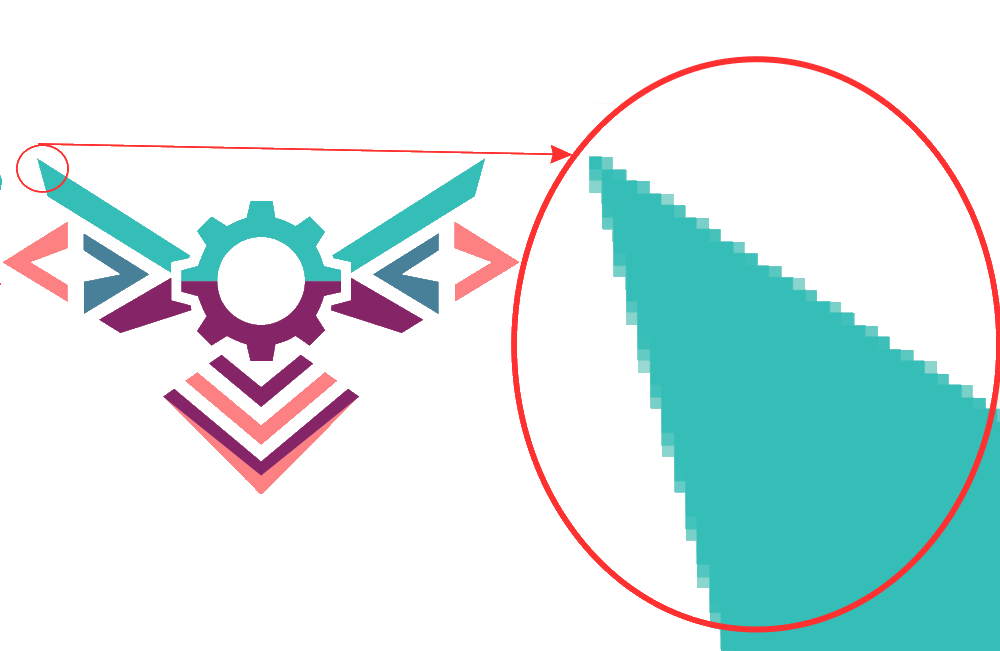
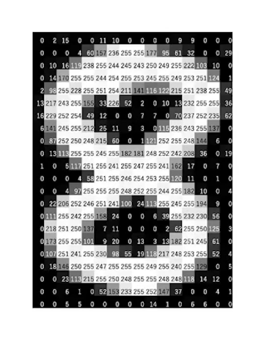
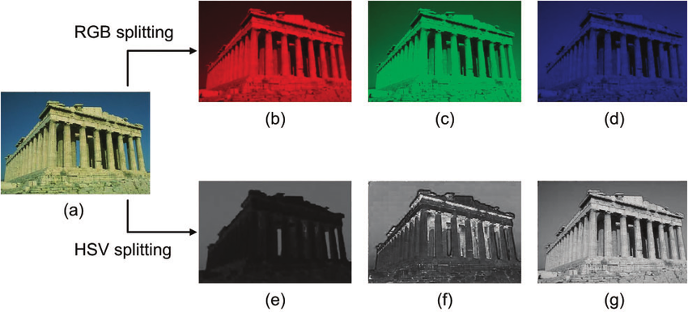
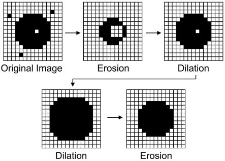
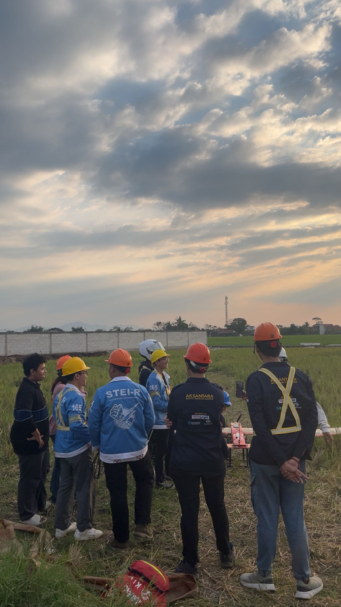
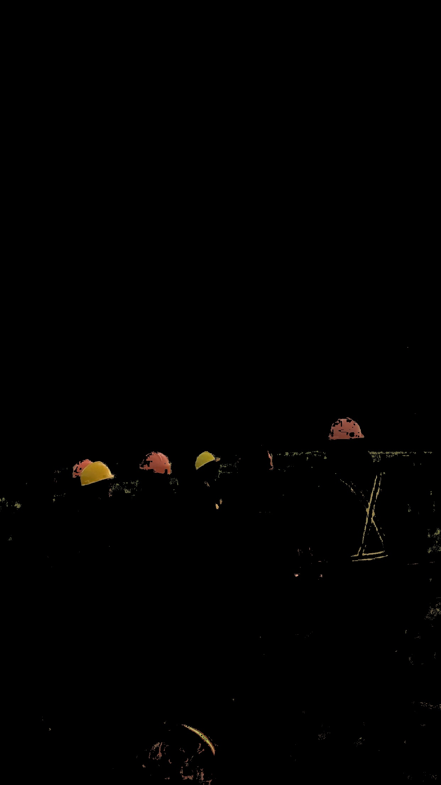

# Computer Vision

## Dasar-Dasar Pengolahan Citra Digital

NB: sangat disarankan untuk baca ini: [MIT Foundations of Computer Vision](https://visionbook.mit.edu/)

### Representasi Citra

Citra, atau gambar yang kita lihat sehari di layar pada dasarnya tersusun atas piksel-piksel yang merupakan unit terkecilnya.

<figure style="text-align: center;">
  
  <figcaption>Contoh citra digital yang terdiri dari piksel-piksel. </figcaption>
</figure>

Secara matematis, kita bisa bayangkan sebuah citra 2D sebagai matriks dua dimensi berukuran tinggi ($H$) x lebar ($W$), di mana setiap elemen matriks tersebut mewakili nilai intensitas cahaya pada piksel tertentu. Misalnya, dalam citra *grayscale*, setiap piksel hanya memiliki satu nilai intensitas yang menunjukkan seberapa terang atau gelapnya piksel tersebut, biasanya dalam rentang 0 (hitam) hingga 255 (putih) untuk representasi 8-bit.

<figure style="text-align: center;">
  
  <figcaption>Representasi matriks citra grayscale. <a href="https://www.analyticsvidhya.com/blog/2021/03/grayscale-and-rgb-format-for-storing-images/">sumber</a></figcaption>
</figure>

Untuk citra berwarna, seperti RGB (Red, Green, Blue), setiap piksel direpresentasikan oleh tiga nilai intensitas yang menunjukkan kontribusi masing-masing warna primer. Jadi, citra RGB dapat dianggap sebagai tumpukan tiga matriks 2D, masing-masing mewakili saluran (*channel*) warna merah, hijau, dan biru. Model  warna lain yang sering digunakan adalah HSV (Hue, Saturation, Value), yang lebih sesuai untuk analisis warna karena memisahkan informasi warna (*hue*) dari kecerahan (*value*). Gambar di bawah ini menunujukkan sebuah gambar yang dipecah berdasarkan ruang warna RGB dan HSV.

<figure style="text-align: center;">
  
  <figcaption>Perbandingan representasi citra dalam ruang warna RGB dan HSV. <a href="https://www.researchgate.net/figure/Comparison-of-RGB-and-HSV-color-space-of-the-No-56-image-67-079-from-the-Berk-ele-y_fig1_372366662">sumber</a></figcaption>
</figure>

### Operasi Neighborhood

*Operasi neighborhood* adalah teknik dasar dalam pengolahan citra digital yang melibatkan manipulasi piksel berdasarkan nilai-nilai piksel di sekitarnya. Kenapa? Karena banyak informasi penting dalam citra, seperti tepi, tekstur, dan pola, dapat diidentifikasi dengan melihat hubungan antar piksel yang berdekatan.

#### Konvolusi/Kernel

Salah satu bentuk *operasi neighborhood* dilakukan dengan menggunakan *kernel*, yang merupakan matriks kecil yang diterapkan pada setiap piksel citra untuk menghasilkan nilai baru berdasarkan nilai-nilai tetangganya. Proses ini dikenal sebagai *convolution*, di mana *kernel* digeser melintasi citra, dan pada setiap posisi, nilai baru dihitung dengan menjumlahkan hasil perkalian elemen-elemen *kernel* dengan nilai-nilai piksel yang sesuai di bawahnya.

<figure style="text-align: center;">
  
  <figcaption>Proses convolution dengan kernel 3x3 pada citra. <a href="https://medium.com/data-science/intuitively-understanding-convolutions-for-deep-learning-1f6f42faee1">sumber</a></figcaption>
</figure>

Misalnya, pada gambar di atas matriks kernelnya adalah:

$$
\begin{bmatrix}
  0 & 1 & 2 \\
  2 & 2 & 0 \\
  0 & 1 & 2
\end{bmatrix}_{3\times3}
$$

dan untuk tiap wilayah 3x3 pada citra, kita kalikan elemen kernel dengan elemen citra yang bersesuaian, lalu jumlahkan hasil semua perkaliannya untuk mendapatkan nilai baru pada piksel output.

Salah satu aplikasi umum dari *convolution* adalah dalam deteksi tepi, di mana *kernel* khusus digunakan untuk menyoroti perubahan tajam dalam intensitas piksel yang menandai keberadaan tepi objek dalam citra. Algoritma Sobel adalah contoh populer yang menggunakan *kernel* untuk mendeteksi tepi secara horizontal dan vertikal, yakni dengan dua *kernel* berbeda $G_x$ dan $G_y$:

$$
G_x = \begin{bmatrix}
  -1 & 0 & 1 \\
  -2 & 0 & 2 \\
  -1 & 0 & 1
\end{bmatrix}
\quad 
\text{dan} 
\quad
G_y = \begin{bmatrix}
  -1 & -2 & -1 \\
  0 & 0 & 0 \\
  1 & 2 & 1
\end{bmatrix}
$$

Jika kita terapkan kedua *kernel* ini pada citra, kita akan mendapatkan dua citra baru yang menyoroti tepi-tepi dalam arah horizontal dan vertikal. Kemudian, kita dapat menggabungkan kedua hasil ini untuk mendapatkan citra akhir yang menampilkan tepi-tepi secara keseluruhan.

Selain deteksi tepi, *convolution* juga digunakan untuk berbagai tujuan lain dalam pengolahan citra, seperti pengaburan (*blurring*), penajaman (*sharpening*), dan peningkatan kontras. Dengan memilih *kernel* yang sesuai, kita dapat mengubah citra dengan cara yang diinginkan. Untuk pengaburan, misalnya, kita bisa menggunakan *kernel* rata-rata atau Gaussian yang menyebarkan nilai piksel ke sekitarnya, menghasilkan efek yang lebih halus. Hal ini dikarenakan kernel untuk Gaussian blur memberikan bobot lebih besar pada piksel yang lebih dekat ke pusat kernel, sehingga menghasilkan efek pengaburan yang lebih alami dibandingkan dengan kernel rata-rata sederhana.

#### Morfologi

Selain konvolusi, ada juga operasi morfologi yang sering digunakan dalam pengolahan citra biner (hitam-putih) untuk memanipulasi bentuk objek dalam citra. Dua operasi morfologi dasar adalah *erosion* dan *dilation*. *Erosion* mengurangi ukuran objek dengan menghapus piksel di tepi objek, sedangkan *dilation* memperbesar objek dengan menambahkan piksel di tepi. Operasi ini sangat berguna untuk membersihkan citra dari noise atau mengisi celah kecil dalam objek.

<figure style="text-align: center;">
  
  <figcaption>Contoh operasi erosion dan dilation pada citra biner. <a href="https://docs.opencv.org/3.4/d9/d61/tutorial_py_morphological_ops.html">sumber</a></figcaption>
</figure>

### Thresholding dan Segmentasi
*Thresholding* (ambang batas) adalah teknik sederhana namun efektif untuk memisahkan objek dari latar belakang dalam citra. Dengan menetapkan ambang batas (threshold) tertentu, kita dapat mengubah citra grayscale menjadi citra biner, di mana piksel dengan nilai di atas ambang batas diatur ke putih (1) dan yang di bawah diatur ke hitam (0), atau bisa juga sekadar menandai piksel yang memenuhi kriteria tertentu. Teknik ini sangat berguna dalam situasi di mana objek memiliki kontras yang jelas terhadap latar belakangnya.

<!-- frame 2 gambar bersebelahan, segment-1.JPG dan segment-2.JPG -->
<figure style="text-align: center;">
  
  
  <figcaption>Contoh citra asli (kiri) dan hasil thresholding (kanan) untuk segmentasi objek.</figcaption>
</figure>

Dengan thresholding, kita dapat dengan mudah mengekstrak objek yang diminati dari citra, yang kemudian dapat digunakan untuk analisis lebih lanjut, seperti penghitungan area, deteksi bentuk, atau pelacakan objek dalam video.

Adapun teknik segmentasi yang lebih canggih melibatkan metode seperti *k-means clustering*, *region growing*, atau *graph-based segmentation*. Teknik-teknik ini memungkinkan pemisahan objek yang lebih kompleks berdasarkan karakteristik warna, tekstur, atau bentuk, sehingga menghasilkan segmentasi yang lebih akurat dalam situasi di mana objek dan latar belakang memiliki variasi yang lebih besar.

### Geometri Kamera dan Proyeksi

- Pinhole camera model (konsep; persamaan bisa dijadikan bonus).
- Coordinate frames & transformasi rigid.
- Intrinsic/extrinsic parameters: makna dan contoh penggunaannya.

### Kalibrasi dan Koreksi

- Distorsi lensa (radial/tangential).
- Prosedur kalibrasi kamera.
- Undistortion dan dampaknya ke akurasi pengukuran dan tracking.

## Eksplorasi OpenCV

Install OpenCV-C++: [Windows](https://youtu.be/CnXUTG9XYGI?si=7UPo6BeSwMMn2v-x) | [Linux](https://youtu.be/Nn5OfJjBGmg?si=REvP-WFoSkhxOFZa)

Install OpenCV-Python: `pip install opencv-python`

### Konsep Dasar OpenCV

Dalam OpenCV, citra direpresentasikan sebagai matriks menggunakan tipe data `cv::Mat` di C++ atau `numpy.ndarray` di Python. `cv::Mat` adalah struktur data yang sangat fleksibel dan efisien untuk menyimpan dan memanipulasi citra digital. Setiap elemen dalam matriks ini mewakili nilai intensitas piksel, dan OpenCV menyediakan berbagai fungsi untuk melakukan operasi pengolahan citra secara langsung pada objek `cv::Mat`.

`cv::Mat` tersusun atas beberapa atribut penting:

- data pointer: pointer ke memori tempat nilai pixel sebenernya disimpan. Biasanya disimpan dalam bentuk matriks. Disimpan dalam bentuk numerik atau kode tertentu.
- rows & cols: Menyimpan informasi tinggi gambar dalam pixel. Misal kalo ada gambar 720p, berarti ketinggiannya 720.
- channels: jumlah saluran warna. Misal RGB ada 3 channels (Red, Green, Blue), Grayscale cuma 1 channel.
- type: tipe data elemen (misalnya, 8-bit unsigned, 32-bit float)
- step: jarak antar baris dalam byte, bisa buat padding atau alignment
- refcount: penghitung referensi untuk manajemen memori otomatis (kayak smart pointer)

### I/O dan Loop Video

Terdapat 3 perintah utama yang digunakan dalam membaca gambar sederhana. Untuk baca file gambar kita bisa pakai `imread` dan buat menampilkan ke window baru pakai `imshow`, serta `imwrite` untuk menyimpan file gambar.

Contohnya di Python dan C++:

```python
import cv2
image = cv2.imread('makan-bergizi-gratis.jpg')
cv2.imshow('aku mau mbg (ini judul windownya)', image)
cv2.waitKey(0)
cv2.destroyAllWindows()
```

```cpp
#include <opencv2/opencv.hpp>
int main() {
    cv::Mat image = cv::imread("makan-bergizi-gratis.jpg");  //Menyimpan dalam cv::Mat
    cv::imshow("aku mau mbg (ini judul windownya)", image);
    cv::waitKey(0);
    cv::destroyAllWindows();
    return 0;
}
```

Contoh yang lebih proper:

```cpp
#include <opencv2/core.hpp> // Librarynya, buat Mat
#include <opencv2/imgcodecs.hpp> // Librarynya, buat imread dan imwrite
#include <opencv2/highgui.hpp> // Librarynya, buat imshow dan waitKey
 
#include <iostream>
 
using namespace cv; // Deklarasi pakai namespace, biar gak perlu nulis cv:: terus
 
int main()
{
    std::string image_path = samples::findFile("starry_night.jpg");
    Mat img = imread(image_path, IMREAD_COLOR);
 
    if(img.empty()) //indikator gagal
    {
        std::cout << "Could not read the image: " << image_path << std::endl;
        return 1;
    }
    imshow("Display window", img);
    int k = waitKey(0); // nunggu input keyboard 0
 
    if(k == 's') // kalo pencet 's' berarti disave
    {
        imwrite("starry_night.png", img); // save gambar
    }
    return 0;
}
```

Biasanya `imread` juga bisa diberi opsi tambahan:

- `IMREAD_COLOR` yang menyimpan gambar dalam format BGR 8-bit.
- `IMREAD_UNCHANGED` yang menyimpan gambar secara default. Pure format gambar
- `IMREAD_GRAYSCALE` yang menyimpan gambar dalam intensitas, hitam putih.

Next, kita akan coba dengan video. Konsep dari membaca video sebenarnya adalah membaca gambar setiap frame dari video. Dalam hal ini kita coba dalam bentuk pengambilan video melalui kamera. Cara kerjanya adalah dengan membuka device kamera, lalu membaca frame per frame dalam loop, dan menampilkannya.

Contoh di Python dan C++:

```python
import cv2
cap = cv2.VideoCapture(0)  # 0 biasanya sih device kamera bawaan
while True:
    ret, frame = cap.read()
    if not ret:
        break
    cv2.imshow('Video Feed', frame)
    if cv2.waitKey(1) & 0xFF == ord('q'):
        break
cap.release() # kameranya ditutup
cv2.destroyAllWindows()
```

```cpp
#include <opencv2/opencv.hpp>
int main() {
    cv::VideoCapture cap(0);  // 0 biasanya sih device kamera bawaan
    if (!cap.isOpened()) {
        return -1; // gagal buka kamera
    }
    cv::Mat frame;
    while (true) {
        cap >> frame; // baca frame
        if (frame.empty()) {
            break; // kalo kosong, keluar loop
        }
        cv::imshow("Video Feed", frame);
        if (cv::waitKey(1) == 'q') {
            break; // keluar kalo pencet 'q'
        }
    }
    cap.release(); // kameranya ditutup
    cv::destroyAllWindows();
    return 0;
}
```

Contoh lagi untuk menampilkan video dari kamera, tapi diubah ke grayscale:

```cpp
#include <opencv2/opencv.hpp>
#include <iostream>
 
using namespace cv;
using namespace std; 
int main() {
    VideoCapture cap(0);

    if (!cap.isOpened()) {
        cout << "Cannot open camera" << endl;
        return -1;
    }
 
    Mat frame, gray;
 
    while (true) {
        cap >> frame;
 
        if (frame.empty()) {
            cout << "Can't receive frame (stream end?). Exiting ..." << endl;
            break;
        }
 
        cvtColor(frame, gray, COLOR_BGR2GRAY);
        imshow("frame", gray);
        if (waitKey(1) == 'q') {
            break;
        }
    }
 
    cap.release();
    destroyAllWindows();
 
    return 0;
}
```

Untuk membuka kamera kita membuat objek `VideoCapture` dengan argumen `0`. Dalam hal ini kita membuka camera default `0` atau jika error coba ganti jadi `1`.

Nilai `0` bisa diganti file video (.mp4, .avi) atau lainnya. Jika nilai `0` diganti menjadi file berformat .mp4, .avi, atau format video lainnya, program akan menampilkan video dibanding membuka kamera sehingga video bisa dimainkan melalui OpenCV, misal semacam `VideoCapture cap(test.mp4);`.

Terakhir, untuk menyimpan video kita bisa menggunakan `VideoWriter`. Contoh:

```py
import cv2
cap = cv2.VideoCapture(0)

fourcc = cv2.VideoWriter_fourcc(*'XVID')
fps = 20.0
frame_size = (640, 480)

video = cv2.VideoWriter('output.avi', fourcc, fps, frame_size)
while cap.isOpened():
    ret, frame = cap.read()
    if not ret:
        break
    frame = cv2.flip(frame, 0)  # mirror effect
    video.write(frame)
    cv2.imshow('frame', frame)
    if cv2.waitKey(1) & 0xFF == ord('q'):
        break
cap.release()
video.release()
cv2.destroyAllWindows()
```

```cpp
#include <opencv2/opencv.hpp>
#include <iostream>
using namespace cv;
using namespace std;

int main() {
    VideoCapture cap(0);
    if (!cap.isOpened()) {
        cout << "gbs buka kamera banh" << endl;
        return -1;
    }

    //  codec video dan frame size
    int fourcc = VideoWriter::fourcc('X','V','I','D');
    double fps = 20.0;
    Size frame_size(640, 480);

    // Membuat objek VideoWriter
    VideoWriter video("output.avi", fourcc, fps, frame_size);
    
    if (!video.isOpened()) {
        cout << "gbs buka file video banh" << endl;
        return -1;
    }

    Mat frame;
    while (cap.isOpened()) {
        cap >> frame;
        if (frame.empty()) {
              cout << "gbs nerima frame wok" << endl;
            break;
        }

        flip(frame, frame, 0); // mirror effect
        video.write(frame);

        imshow("frame", frame);
        if (waitKey(1) == 'q') {
            break;
        }
    }

    cap.release();
    video.release();
    destroyAllWindows();

    return 0;
}
```

### Fitur OpenCV

Silakan eksplorasi sendiri via [OpenCV Documentation](https://docs.opencv.org/4.x/) atau tutorial di YouTube.

- Color Space & Conversion
- Basic Image Processing
- Thresholding & Binarization
- Edge Detection & Gradient
- Contours & Shape Analysis
- Morphological Operations
- Feature Detection & Description
- Feature Matching
- Object Detection
- Deep Learning
- Camera Calibration & Geometry
- Motion Analysis & Tracking
- Machine Learning
- Drawing & Annotation

## AI dalam Computer Vision

### Machine Learning

Machine learning adalah cabang dari kecerdasan buatan yang berfokus pada pengembangan algoritma dan model statistik yang memungkinkan komputer untuk belajar dari data dan membuat prediksi atau keputusan tanpa perlu diprogram secara eksplisit untuk setiap tugas. Dalam konteks *computer vision*, *machine learning* digunakan untuk mengajarkan komputer mengenali pola, objek, dan fitur dalam gambar atau video. Dalam *machine learning*, model dilatih menggunakan dataset yang berisi contoh-contoh input (seperti gambar) dan output yang diharapkan (seperti label objek dalam gambar). Proses pelatihan ini melibatkan penyesuaian parameter model agar dapat meminimalkan kesalahan prediksi pada data pelatihan.

#### Pendekatan

Sebagaimana akan teman-teman pelajari di matkul AI-AI an nantinya, ada beberapa pendekatan utama dalam *machine learning*, yaitu:

- Supervised Learning: pada dasarnya kalau di manusia mirip kayak belajar dari contoh. Model dilatih menggunakan data yang sudah berlabel, artinya setiap input memiliki output yang diketahui. Contohnya adalah klasifikasi gambar, di mana model belajar untuk mengenali objek dalam gambar berdasarkan label yang diberikan selama pelatihan.
- Unsupervised Learning: pada dasarnya mirip kayak belajar dari pola. Model dilatih menggunakan data yang tidak berlabel, sehingga model harus menemukan struktur atau pola tersembunyi dalam data tersebut. Contohnya adalah pengelompokan (*clustering*), di mana model mencoba mengelompokkan gambar berdasarkan kesamaan fitur tanpa mengetahui label objek di dalamnya.
- Reinforcement Learning: ini mirip kayak belajar dari trial and error. Model belajar untuk membuat keputusan dengan berinteraksi dengan lingkungan dan menerima umpan balik dalam bentuk hadiah (kalau berhasil) atau hukuman (kalau gagal). Contohnya adalah pelatihan agen untuk bermain game, di mana agen belajar strategi terbaik untuk memenangkan permainan berdasarkan hasil dari tindakannya.

#### Proses Pelatihan Model

Dalam pelatihan model *machine learning*, terdapat beberapa langkah penting yang perlu diperhatikan:

- Data Preprocessing: membersihkan dan menyiapkan data agar sesuai untuk pelatihan. Ini bisa melibatkan normalisasi, augmentasi, atau transformasi data.
- Feature Extraction: mengidentifikasi dan mengekstrak fitur-fitur penting dari data yang akan digunakan oleh model untuk belajar.
- Model Selection: memilih algoritma atau arsitektur model yang sesuai untuk tugas yang dihadapi, seperti regresi, pohon keputusan, atau jaringan saraf.
- Training: proses di mana model belajar dari data pelatihan dengan menyesuaikan parameter-parameter internalnya untuk meminimalkan kesalahan prediksi.
- Validation: mengevaluasi kinerja model pada data yang tidak digunakan selama pelatihan untuk memastikan bahwa model dapat menggeneralisasi dengan baik.
- Testing: menguji model akhir pada data yang benar-benar baru untuk menilai kinerjanya secara objektif.

#### Masalah Umum

Salah satu masalah umum dalam *machine learning* adalah *overfitting*, di mana model belajar terlalu baik pada data pelatihan sehingga kehilangan kemampuan untuk menggeneralisasi pada data baru. Idenya adalah model terlalu "menghafal" data pelatihan, termasuk noise atau outlier, sehingga performanya menurun saat dihadapkan pada data yang belum pernah dilihat sebelumnya. Untuk mengatasi *overfitting*, biasanya kita pakai regularisasi, dropout, atau cross-validation.

### Evaluasi Model

Bagaimana kita tahu kalo model yang kita buat itu bagus atau enggak? Nah, di sinilah pentingnya evaluasi model. Ada beberapa metrik yang umum digunakan untuk menilai kinerja model *machine learning* dalam tugas-tugas *computer vision*, tergantung pada jenis tugasnya, seperti klasifikasi, deteksi objek, atau segmentasi.

#### Metrik Evaluasi Klasifikasi
Pada dasarnya, ketika model melakukan prediksi, hasilnya bisa benar atau salah. Dari sini kita bisa buat *confusion matrix* yang menunjukkan jumlah prediksi benar dan salah untuk setiap kelas.

<figure style="text-align: center;">
  
  <figcaption>Contoh confusion matrix untuk klasifikasi biner. <a href="https://towardsdatascience.com/understanding-confusion-matrix-a9ad42dcfd62">sumber</a></figcaption>
</figure>

Dari *confusion matrix* ini, kita bisa hitung beberapa metrik penting, yaitu accuracy, precision, recall, dan F1-score.

##### Accuracy

Seperti namanya, accuracy mengukur seberapa akurat model dalam melakukan prediksi. Secara matematis, accuracy dihitung sebagai persentase total prediksi yang benar dari keseluruhan data:
$$
\text{Accuracy} = \frac{TP + TN}{TP + TN + FP + FN}
$$

##### Precision

Precision mengukur tingkat ketepatan prediksi positif, yaitu seberapa banyak dari semua prediksi positif yang benar-benar positif. Rumusnya adalah:
$$
\text{Precision} = \frac{TP}{TP + FP}
$$

##### Recall

Recall mengukur tingkat keberhasilan model dalam menemukan data positif, yaitu seberapa banyak dari semua data positif yang berhasil ditemukan oleh model. Rumusnya adalah:

$$
\text{Recall} = \frac{TP}{TP + FN}
$$

##### F1-score

F1-score adalah harmonic mean dari precision dan recall. Rumusnya adalah:
$$
\text{F1-score} = 2 \times \frac{\text{Precision} \times \text{Recall}}{\text{Precision} + \text{Recall}}
$$

#### Metrik Evaluasi Deteksi dan Segmentasi Objek

Selanjutnya, untuk tugas deteksi dan segmentasi objek, ada metrik khusus yang sering digunakan, yaitu Intersection over Union (IoU) dan Mean Average Precision (mAP) untuk deteksi, serta Dice coefficient untuk segmentasi.

##### Intersection over Union (IoU) dan Mean Average Precision (mAP)

IoU mengukur seberapa baik prediksi bounding box dari model tumpang tindih dengan ground truth bounding box. Rumusnya adalah:
$$
\text{IoU} = \frac{\text{Area of Overlap}}{\text{Area of Union}}
$$  

Mean Average Precision (mAP) adalah metrik yang menggabungkan precision dan recall pada berbagai threshold IoU untuk memberikan gambaran keseluruhan kinerja model deteksi objek. mAP dihitung dengan mengambil rata-rata dari Average Precision (AP) untuk setiap kelas objek.

##### Dice Coefficient

Dice coefficient adalah metrik yang digunakan untuk mengukur kesamaan antara dua set, sering digunakan dalam segmentasi citra. Rumusnya adalah:
$$
\text{Dice} = \frac{2 \times |A \cap B|}{|A| + |B|}
$$

Nantinya bobot nilai irisan diberi nilai lebih besar, sehingga model lebih fokus pada area yang benar-benar penting.

### Deep Learning

Deep learning adalah subset dari *machine learning* yang menggunakan jaringan saraf tiruan dengan banyak lapisan (deep *neural networks*) untuk mempelajari representasi data yang kompleks. Apa maksudnya? Pada dasarnya, salah satu cara membuat model yang bisa mengenali pola seperti otak manusia adalah dengan meniru cara kerja otak itu sendiri, yaitu melalui jaringan saraf. Deep learning memungkinkan kita untuk membangun model yang sangat kuat dan fleksibel, yang dapat belajar dari data dalam jumlah besar dan menangani tugas-tugas yang kompleks seperti pengenalan gambar, pemrosesan bahasa alami, dan banyak lagi.

Salah satu arsitektur deep learning yang paling populer untuk tugas-tugas computer vision adalah Convolutional Neural Networks (CNNs). CNN dirancang khusus untuk memproses data yang memiliki struktur grid, seperti gambar, dan mereka sangat efektif dalam mengenali pola visual. CNN memahami hubungan spasial antar piksel melalui matriks konvolusinya.

<figure style="text-align: center;">
  
  <figcaption><a href="https://medium.com/@Suraj_Yadav/in-depth-knowledge-of-convolutional-neural-networks-b4bfff8145ab">sumber</a></figcaption>
</figure>

Inti dari CNN adalah lapisan konvolusi yang menerapkan filter (kernel) berukuran kecil pada gambar input untuk mengekstrak fitur-fitur penting seperti tepi, sudut, dan tekstur. Lapisan pooling kemudian digunakan untuk mereduksi dimensi data sambil mempertahankan informasi penting, sehingga mengurangi beban komputasi dan membantu mencegah overfitting. Filter digeser di seluruh gambar untuk menghasilkan peta fitur (feature maps) yang menyoroti area-area penting. Setelah beberapa lapisan konvolusi dan pooling, data biasanya diratakan (flatten) dan diteruskan ke lapisan fully-connected (dense layer) yang melakukan klasifikasi berdasarkan fitur yang telah diekstraksi.

## Referensi & Bacaan Lanjutan

[A guide to convolution arithmetic for deep learning oleh Vincent Dumoulin and Francesco Visin](https://arxiv.org/pdf/1603.07285)

[Intuitively Understanding Convolutions for Deep Learning oleh Irhum Shafkat](https://medium.com/data-science/intuitively-understanding-convolutions-for-deep-learning-1f6f42faee1)
